# GPT Image 2 Prompt Gallery

A curated gallery of GPT-Image-2 prompt examples with one reviewed output image per prompt.

> Source links point to the original public X/Twitter posts. Images are archived locally for stable GitHub display. If you are a rights holder and want a case removed or corrected, please open an issue.

**Cases:** 62

## Cases

### GPT Image 2 Prompt Case 0001: Prompt: Jinx from Arcane, rendered in an American-style thick paint illustration

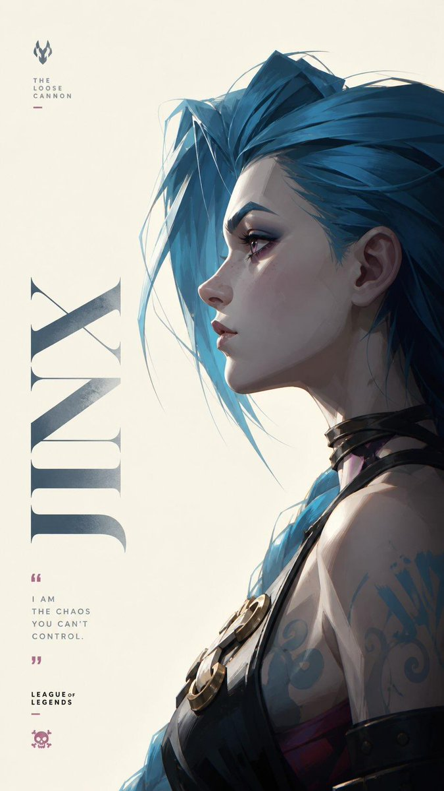

**Prompt:**

```text
Prompt: Jinx from Arcane, rendered in an American-style thick paint illustration. Side-profile, half-body close-up with the character faithfully matching the original design, gaze directed to the left. Minimalist beige background with extensive negative space, composition weighted to the right. Clean, premium aesthetic with soft, cinematic lighting, rim light, high contrast but low saturation color palette, with subtle accent colors reflecting the character’s main tones. Geometric, faceted painting style with detailed skin texture and hair strands. Commercial poster layout with bold headline typography design. Vertical 9:16 format.
```

[Original post](https://x.com/Ciri_ai/status/2051639861053174109)

### GPT Image 2 Prompt Case 0002: Prompt: Top-down static shot, clean kitchen aesthetic, soft natural daylight wit

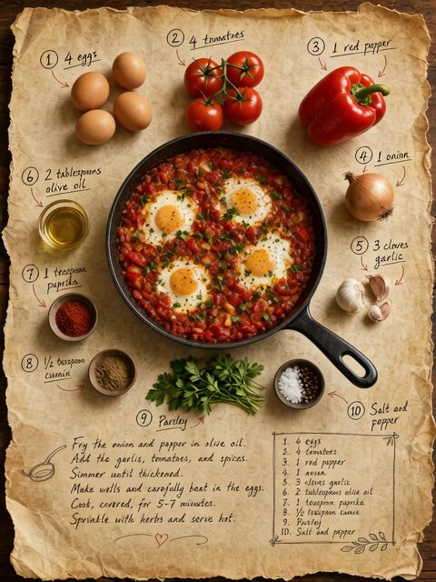

**Prompt:**

```text
Prompt:
Top-down static shot, clean kitchen aesthetic, soft natural daylight with warm tones, subtle shadows, high realism, 9:16 vertical.Scene (0–2s):
A well-groomed woman’s hand enters smoothly from the left, holding an elegant fork. A sizzling frying pan sits centered with a perfectly cooked egg. Gentle steam rises. The audio features soft, satisfying frying sounds.Scene (2–4s):
The fork slowly scoops into the egg with a natural, precise motion. Minimalist drawn arrows softly animate in, pointing toward key ingredients (egg yolk, seasoning, texture). The arrows flicker subtly, clean and modern — not distracting.Scene (4–6s):
Camera performs a slow, subtle zoom-in, enhancing detail — glossy yolk, crispy edges, and texture become more mouth-watering. The hand lifts slightly, holding the bite in focus. Text remains static, sharp, and legible.
Style Notes:
Ultra-clean composition, no clutter, no artifacts or watermarks, realistic motion, soft culinary ASMR vibe, crisp details for post-enhancement, smooth micro-movements, premium food-ad feel.
```

[Original post](https://x.com/ShamiWeb3/status/2051246886124921125)

### GPT Image 2 Prompt Case 0003: Prompt: Edit the image while keeping the original photo completely unchanged — i

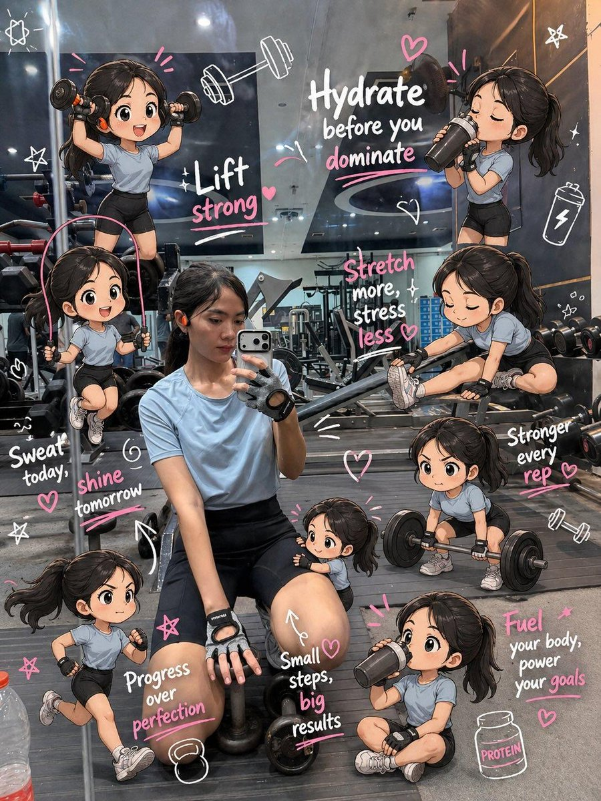

**Prompt:**

```text
Prompt: Edit the image while keeping the original photo completely unchanged — including the person, face, body, pose, lighting, and gym background.
Add multiple small, cute chibi-style “mini versions” of her around the image. Each mini character should have a big head, expressive facial features, and match her hairstyle and outfit.
Depict each mini version doing different gym-related activities:
one cheering with arms raised
one running in running shoes
one drinking from a shaker bottle
one wearing sporty running glasses
one climbing near her leg
```

[Original post](https://x.com/Ciri_ai/status/2050094437821513896)

### GPT Image 2 Prompt Case 0004: Prompt: Use the original face from the reference photo. Background same as the p

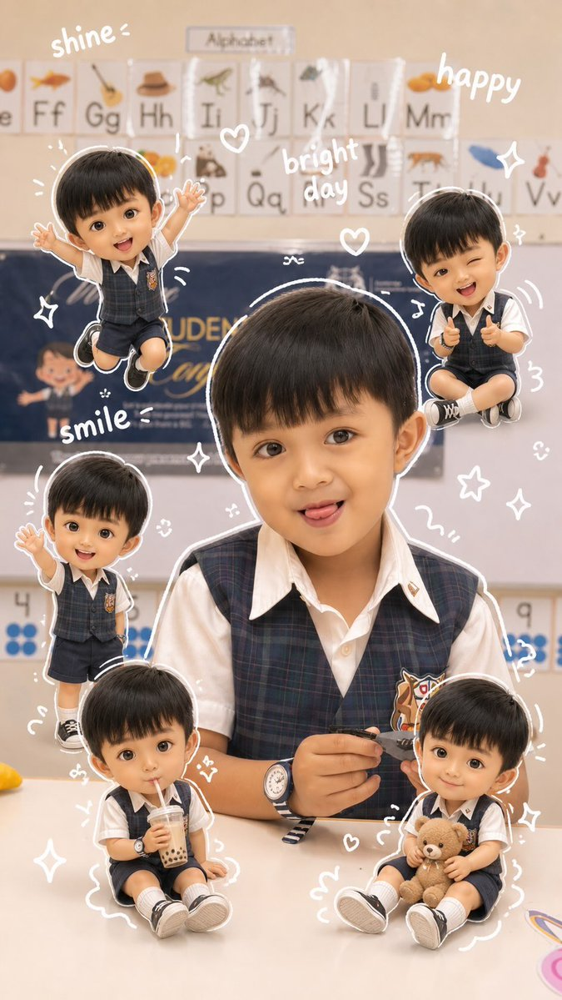

**Prompt:**

```text
Prompt:
Use the original face from the reference photo. Background same as the photo. Warm, soft, clean lighting with soft shadows. Surround it with several 3D cute style mini chibi versions of themselves, keeping the original facial features. The chibi characters have various poses and expressions: cheerful jumping, waving, sitting casually holding a drink, and cute/playful expressions. Add white hand-drawn style doodle elements: outlines around the main body, stars, hearts, sparkles, and motion lines. Add aesthetic handwriting text like: 'shine', 'bright day',
'happy', 'smile', etc. (casual doodle font). Overall style: clean & aesthetic composition, white sticker outline, soft pastel color tone, high detail 3D chibi, glossy look, cute Korean style, instagramable
```

[Original post](https://x.com/ChillaiKalan__/status/2051209193336545713)

### GPT Image 2 Prompt Case 0005: Prompt; Edit the image while preserving the original photo exactly as it is, do

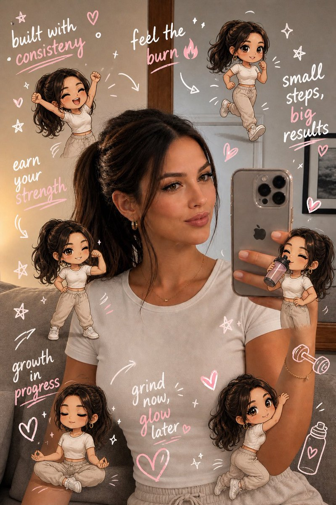

**Prompt:**

```text
Prompt;
Edit the image while preserving the original photo exactly as it is, do not alter the subject, facial features, body proportions, pose, lighting, or the gym environment in any way.
Surround the subject with several tiny, adorable chibi-style mini characters inspired by her. Each mini version should feature an oversized head, lively and expressive facial expressions, and replicate her hairstyle and outfit details.
Show each mini character engaged in different fitness-related actions, such as:
celebrating with raised hands
jogging energetically
sipping from a workout shaker
posing with stylish athletic sunglasses
```

[Original post](https://x.com/j_smeaton99/status/2051491180446388403)

### GPT Image 2 Prompt Case 0006: Prompt: Using the BTS logo, generate a premium brand identity system poster. Eve

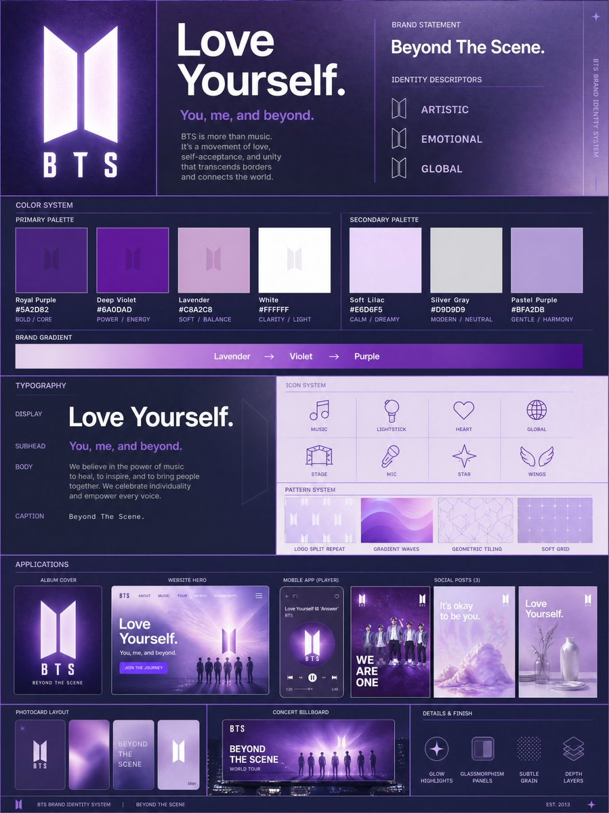

**Prompt:**

```text
Prompt:
Using the BTS logo, generate a premium brand identity system poster. Every element — color, tone, texture, and composition — must be derived directly from the logo. No generic outputs. Structure: Vertical 4:5 poster. Soft lavender to deep purple gradient background. Multi-layered grid. Dense, clean, zero dead space. Violet rule lines separate sections. Top: BTS logo in bold clean type. Brand statement: "Beyond The Scene." Identity descriptors: ARTISTIC / EMOTIONAL / GLOBAL. Colors: Primary — Royal Purple #5A2D82, Deep Violet #6A0DAD, Lavender #C8A2C8, White #FFFFFF. Secondary — Soft Lilac #E6D6F5, Silver Gray #D9D9D9, Pastel Purple #BFA2DB. Show large color blocks, HEX codes, usage labels, and a Lavender→Violet→Purple gradient bar. Typography: Display headline "Love Yourself." in white. Purple sans-serif subhead. Soft gray body text. Tiny monospaced caption. Clear 4-level hierarchy. Applications: Album cover mockup. Bright website hero with purple CTA. Mobile app music player UI. Three social posts — bold purple performance, soft emotional pastel, clean lavender lifestyle. Photocard layout. Purple gradient concert billboard. Icons: 8 line icons — music note, lightstick, heart, globe, stage, mic, star, wings. Purple 1.5px strokes. Consistent style. Patterns: Logo split repeat, gradient waves, geometric tiling, soft grid. Micro details: Glow highlights, glassmorphism panels, subtle grain, depth layers. Final feel: Behance top project. Agency-quality. Unmistakably BTS.
```

[Original post](https://x.com/ShamiWeb3/status/2051659466249224444)

### GPT Image 2 Prompt Case 0007: This GPT Image 2 prompt is going insanely viral right now. “Redraw the attached

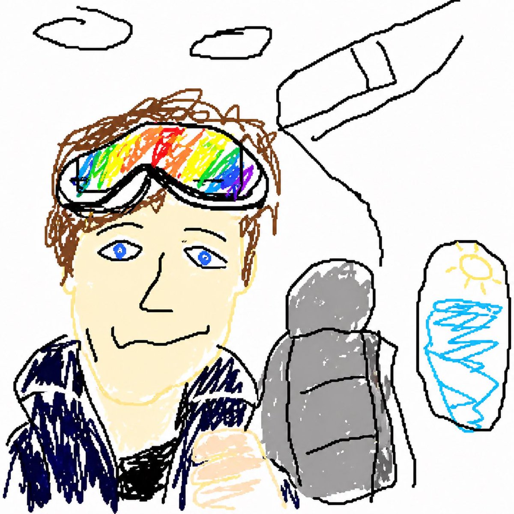

**Prompt:**

```text
This GPT Image 2 prompt is going insanely viral right now.
“Redraw the attached image in the most clumsy, scribbly, and utterly pathetic way possible. Use a white background, and make it look like it was drawn in MS Paint with a mouse. It should be vaguely similar but also not really, kind of matching but also off in a confusing, awkward way, with that low-quality pixel-by-pixel feel that really emphasizes how ridiculously bad it is. Actually, you know what, whatever, just draw it however you want.”
```

[Original post](https://x.com/arrakis_ai/status/2049689793118998717)

### GPT Image 2 Prompt Case 0008: Prompt { "type": "image_prompt", "title": "Naruto Propaganda Poster", "subject"

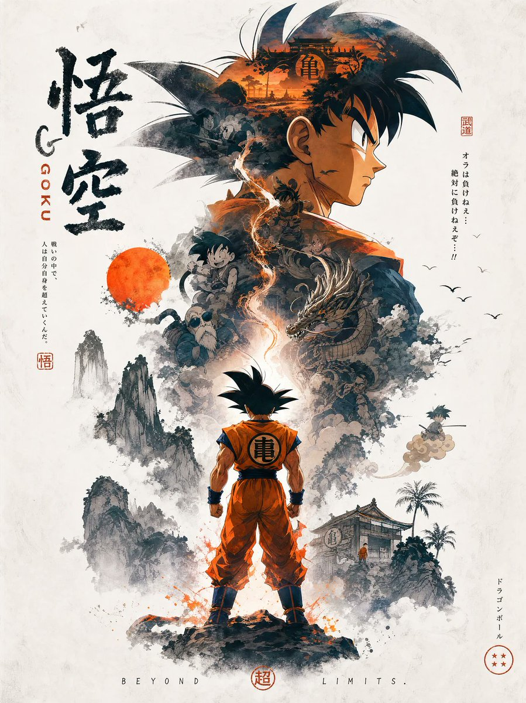

**Prompt:**

```text
Prompt
{
"type": "image_prompt",
"title": "Naruto Propaganda Poster",
"subject": {
"character": "Naruto",
"source": "Naruto anime",
"focus": "iconic propaganda-style artistic reinterpretation"
```

[Original post](https://x.com/Just_sharon7/status/2051207505276260792)

### GPT Image 2 Prompt Case 0009: Prompt: Create an adorable character design sheet based on the uploaded image. S

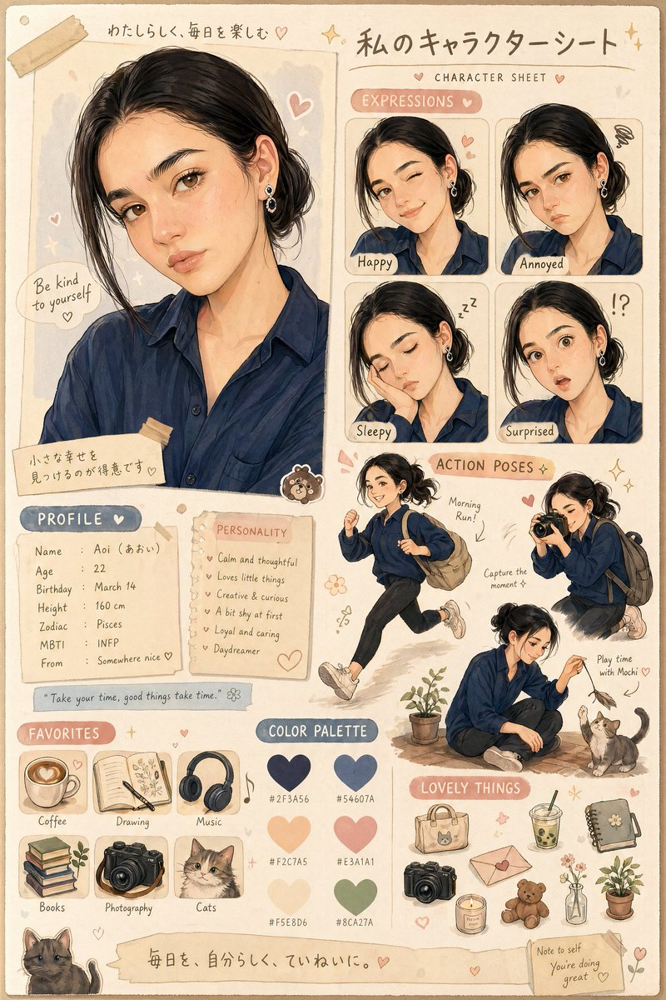

**Prompt:**

```text
Prompt:
Create an adorable character design sheet based on the uploaded image.
Style: Warm, soft, and semi-realistic cartoon illustration with a cozy Japanese/kawaii style.
Design: Character profile poster including:
Large main portrait
Various facial expressions (happy, annoyed, sleepy, surprised)
Action poses (running, playing) (based on personality)
Small object icons
```

[Original post](https://x.com/ZaraIrahh/status/2048251738604613725)

### GPT Image 2 Prompt Case 0010: "prompt": { "title": "Agency-Grade Pizza Hut Brand Identity System Poster", "tri

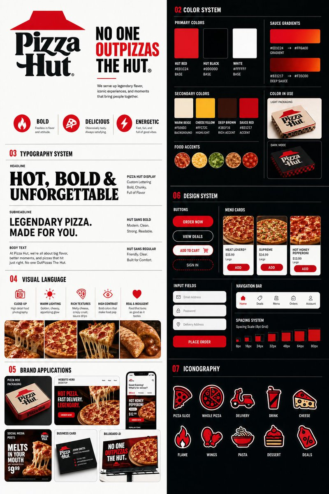

**Prompt:**

```text
"prompt": {
"title": "Agency-Grade Pizza Hut Brand Identity System Poster",
"trigger": "Use the Pizza Hut logo to construct a complete, high-impact brand identity system poster — bold, appetizing, and instantly recognizable.",
"prime_directive": {
"rule": "Every element — color, tone, shape, texture, personality — must be derived from Pizza Hut’s iconic red, black, and white branding, including its signature hat logo and food-driven identity.",
"enforcement": "No generic design. Everything must reflect Pizza Hut’s bold, energetic, and appetizing brand personality."
},
"format": {
```

[Original post](https://x.com/saniaspeaks_/status/2051527005242368362)

### GPT Image 2 Prompt Case 0011: PROMPT: A highly realistic low-angle shot of a confident young woman with long

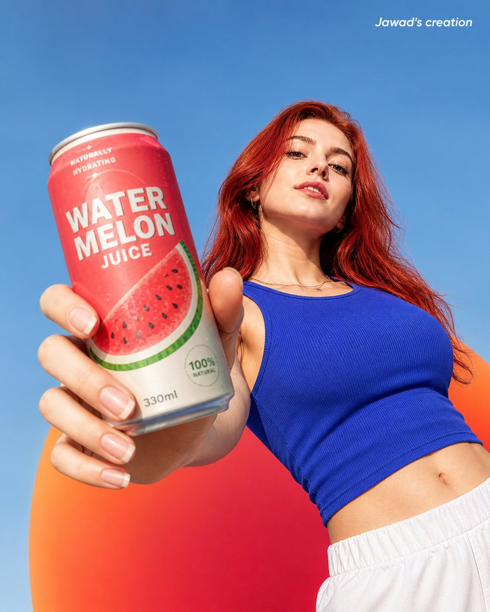

**Prompt:**

```text
PROMPT:
A highly realistic low-angle shot of a confident young woman with long, vibrant red hair, holding a watermelon juice can close to the camera in a dramatic perspective. The can appears large in the foreground due to forced perspective, with sharp focus on the product. The woman has fair skin, natural makeup, and a subtle confident expression, looking slightly down toward the camera.
She is wearing a fitted blue sleeveless crop top and light gray sweatpants. Her posture is relaxed yet bold, with one arm extended forward holding the can.
The background is a smooth, colorful gradient blending blue, orange, and red tones, creating a vibrant summer aesthetic. Bright natural sunlight illuminates the scene with soft shadows and high contrast, giving a clean commercial photography look.
The juice can design features a watermelon theme with red and green colors, minimal modern typography, and realistic texture details like condensation droplets.
Ultra-detailed, photorealistic, 8K resolution, sharp focus, shallow depth of field, professional product photography, vibrant colors, cinematic lighting.
Add text: "Your name" in small clean white font at the upper right corner.
Follow me for more @Jawad_Rahman_
```

[Original post](https://x.com/Jawad_Rahman_/status/2051671878608228630)

### GPT Image 2 Prompt Case 0012: Prompt: Edit this photo into a cute Pinterest/Xiaohongshu-style doodle aesthetic

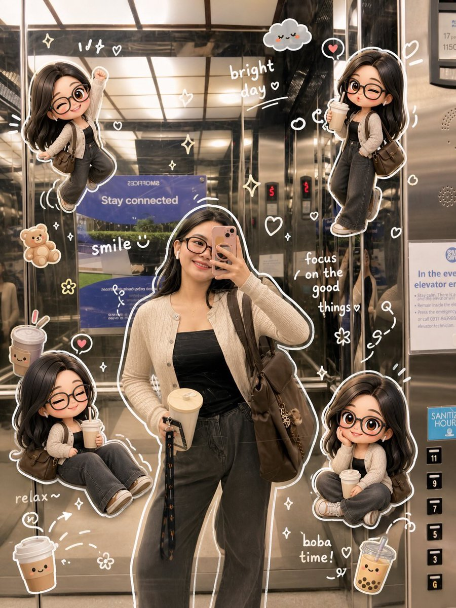

**Prompt:**

```text
Prompt:
Edit this photo into a cute Pinterest/Xiaohongshu-style doodle aesthetic edit while keeping the original composition and colors natural. Do NOT heavily change the original lighting or color grading. Keep the tones soft, airy, warm, and realistic. Avoid oversaturated colors, HDR effects, strong orange filters, or excessive contrast. Add hand-drawn doodle elements around the main objects: * white outline strokes * sketchy sparkles * stars * hearts * arrows * tiny flowers * playful swirls * mini handwritten notes Add small cute mascot-style doodles that match the vibe of the photo (tiny bear, smiling drink, cute food character, sleepy cloud, etc.) but keep them subtle and balanced. Use handwritten white text with short relatable captions only. Do NOT add too many words or overcrowd the image.Use a real face as a reference photo. The background is the same as in the photo. The lighting is warm, soft, and clean, with subtle shadows. Around the image, add several mini chibi (3D cute style) versions of the character, while maintaining the original facial features.Chibi characters have various poses and expressions: jumping cheerfully waving sitting relaxed holding a drink cute and playful expressions.  Add hand-drawn white doodle elements: outline around the main body stars, hearts, sparkles motion lines small cute icons Add aesthetic handwriting such as: "shine," "bright day," "happy," "smile," etc. (casual doodle font) Overall style: clean & aesthetic composition white sticker outline soft pastel color tone high detail 3D chibi glossy look cute Korean.
```

[Original post](https://x.com/i/status/2050614367536939243)

### GPT Image 2 Prompt Case 0013: Prompt: Based on { TOPIC }, create a high-quality vertical “encyclopedia-style e

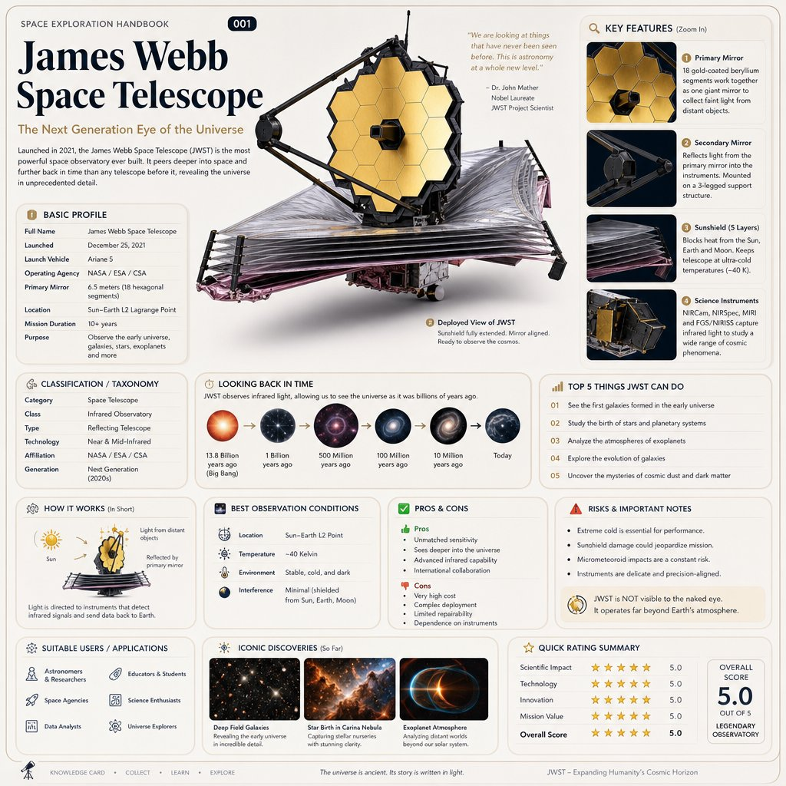

**Prompt:**

```text
Prompt: Based on { TOPIC }, create a high-quality vertical “encyclopedia-style educational infographic image.”
This image should NOT look like a regular poster or a simple illustration. Instead, it should feel like a structured knowledge guide that combines:
the feeling of a collectible reference handbook
a modern encyclopedia page
a lifestyle knowledge card
and a highly shareable social-media infographic
The overall style should resemble a premium natural-history guidebook mixed with modern editorial infographic design.
The image should include:
```

[Original post](https://x.com/i/status/2051889025229930547)

### GPT Image 2 Prompt Case 0014: Prompt: instructions> [SUBJECT]=Coronavirus. A hyper-realistic 3D zoom-sequence

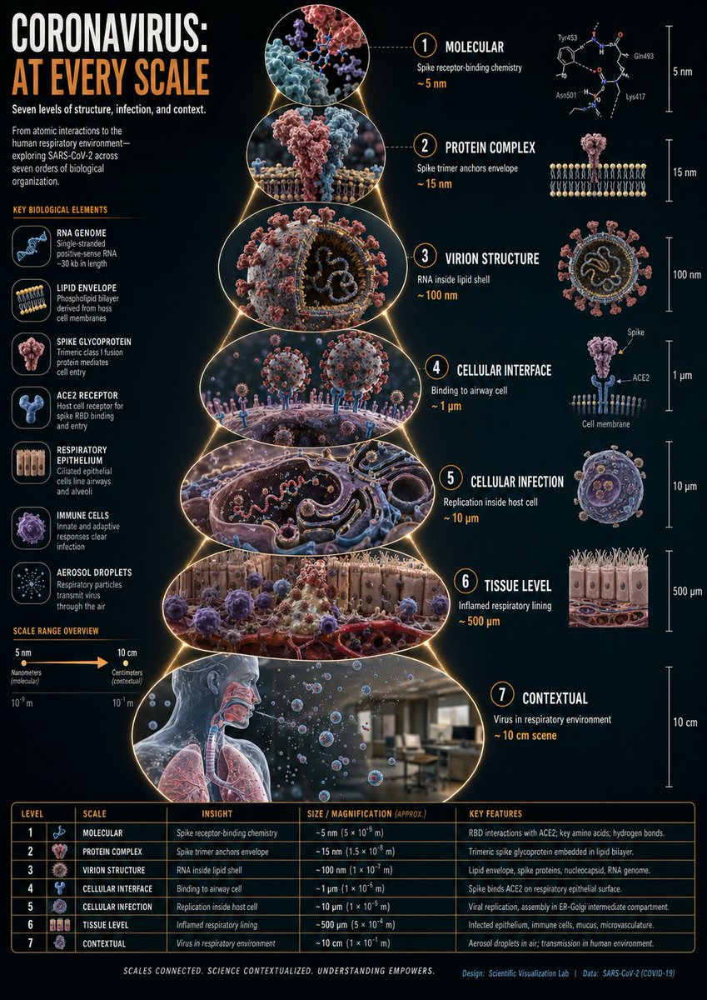

**Prompt:**

```text
Prompt:
instructions> [SUBJECT]=Coronavirus. A hyper-realistic 3D zoom-sequence infographic generated from a single input: [SUBJECT]. The system auto-detects scale layers from atomic/subcomponent to full contextual view. Layout Structure (CRITICAL) 6–8 circular or hexagonal frames arranged in expanding sequence Innermost frame = smallest detectable detail; outermost = full subject in environment Frames connected by subtle zoom-path lines No repeated scales — each frame shows new level of detail Frame Design Each zoom level includes: Hyper-detailed 3D render at that scale Micro label: scale name (e.g., "molecular," "cellular," "structural") + 3–5 word insight Optional: measurement tag or magnification factor Contextual Halo Around the sequence, include only scale-specific references: Measurement units, scientific notation, cultural scale metaphors (No generic magnifying glass icons) Scale Panel (Alternative Layout) Zoom level Key insight (3–5 words) Scale factor tag Detail icon (grid, wave, particle, etc.) Title "[SUBJECT]: AT EVERY SCALE" (or) "ZOOM: THE WORLD OF [SUBJECT]" Style: ultra-realistic 3D render, scientific editorial infographic, precise macro lighting, global illumination, shallow depth of field, clean sequential layout. </instructions>
```

[Original post](https://x.com/i/status/2051288232613351571)

### GPT Image 2 Prompt Case 0015: Prompt: Use a real face as a reference photo. The background is the same as in t

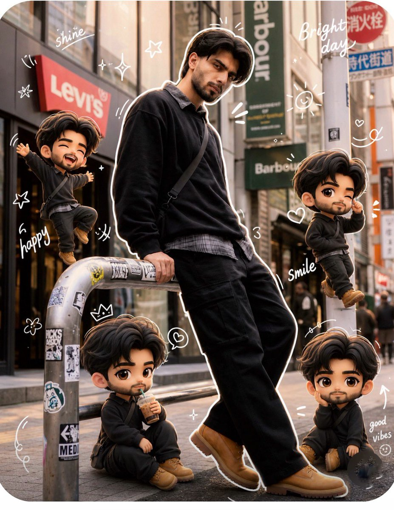

**Prompt:**

```text
Prompt:
Use a real face as a reference photo. The background is the same as in the photo. The lighting is warm, soft, and clean, with subtle shadows. Around the image, add several mini chibi (3D cute style) versions of the character, while maintaining the original facial features. Chibi characters have various poses and expressions:jumping cheerfully waving sitting relaxed holding a drink cute and playful expressions Add hand-drawn white doodle elements: outline around the main body stars, hearts, sparkles motion lines small cute icons Add aesthetic handwriting such as: "shine," "bright day," "happy," "smile," etc. (casual doodle font) Overall style: clean & aesthetic composition white sticker outline soft pastel color tone high detail 3D chibi glossy look cute Korean.
```

[Original post](https://x.com/i/status/2050201037144002786)

### GPT Image 2 Prompt Case 0016: Prompt and examples. Copy it for your business. I came up with (maybe others did

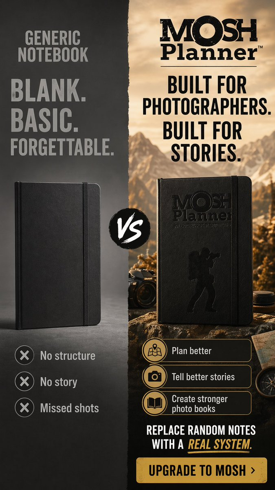

**Prompt:**

```text
Prompt and examples. Copy it for your business.
I came up with (maybe others did too) the best prompt for GPT image 2 for a business in creating Facebook ads.
Prompt: Create 10 images for facebook ads targeting people who might be interested in buying [product]. Use the information and images from [webstie]. 9:16.
#gptimage2 #prompt #facebookads
```

[Original post](https://x.com/i/status/2051006735041900782)

### GPT Image 2 Prompt Case 0017: Prompt: Create a Playful, energetic and refreshing high-end editori-al brand ide

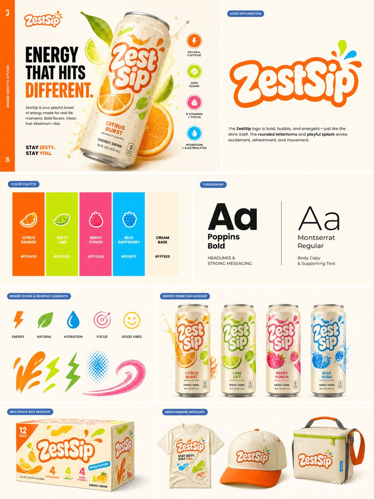

**Prompt:**

```text
Prompt: Create a Playful, energetic and refreshing high-end editori-al brand identity System for a energy drink brand named "ZestSip." The presentation should feel like a high-end case study Brand personality Playful, energetic, modern, refresh-ing. The logo should be Logo Rounded. bold. bubbly word-mark.maintain the logo on every slide and item, typogra-phy hi- erarchy. premium sporty. punchy. youthful, active font pairing, curated brand color palette. Show realistic brand applications mockups, including Energy Drink Can Mockup. Multipack Box Mockup. T-shirt, cap. cooler bag. Use a Playful, energetic, modern, refreshing color pal- ette such as Cream base. Orange. Lime. Berry. Blue Raspberry. The layout should be Playful. energetic, and editorial, with a sharp grid structure, strong typography. Playful, energetic. modern, refreshing branding feel, hyper-detailed presenta-tion, ultra-realistic mockups.
```

[Original post](https://x.com/i/status/2050853725275906049)

### GPT Image 2 Prompt Case 0018: Prompt: Edit the image while keeping the original photo completely unchanged, in

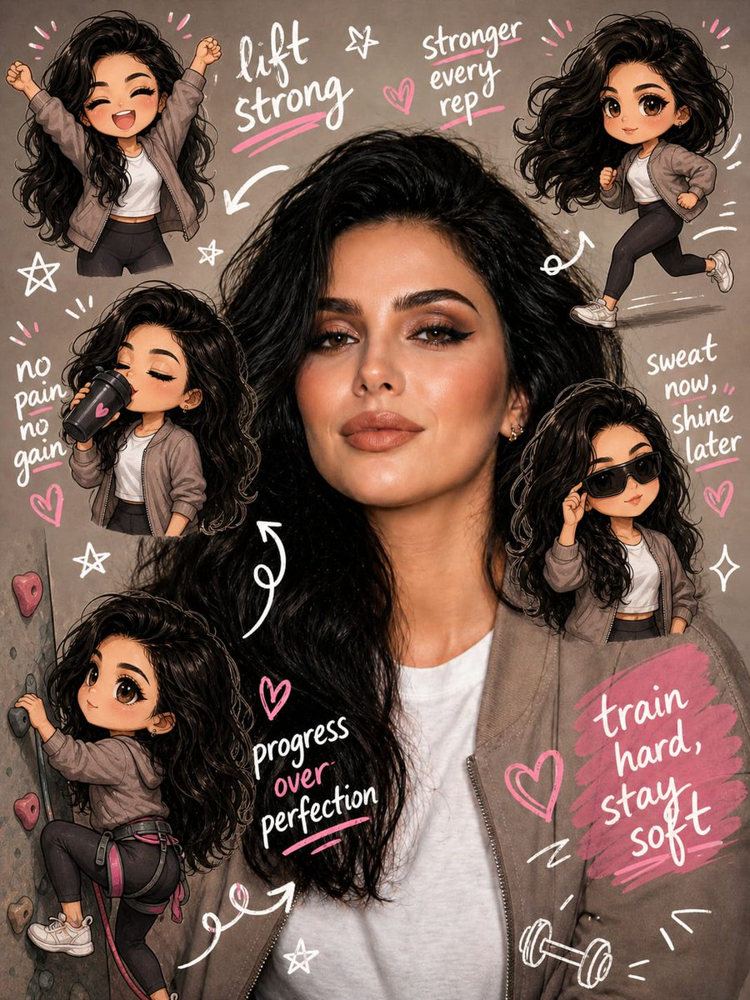

**Prompt:**

```text
Prompt:
Edit the image while keeping the original photo completely unchanged, including the person, face, body, pose, lighting, and gym background.
Add multiple small, cute chibi-style “mini versions” of her around the image. Each mini character should have a big head, expressive facial features, and match her hairstyle and outfit.
Depict each mini version doing different gym-related activities:
one cheering with arms raised
one running in running shoes
one drinking from a shaker bottle
one wearing sporty running glasses
```

[Original post](https://x.com/i/status/2051336962012037617)

### GPT Image 2 Prompt Case 0019: Prompt: Create a bold single campaign poster for NEXORA. Aspect ratio 4:5. This

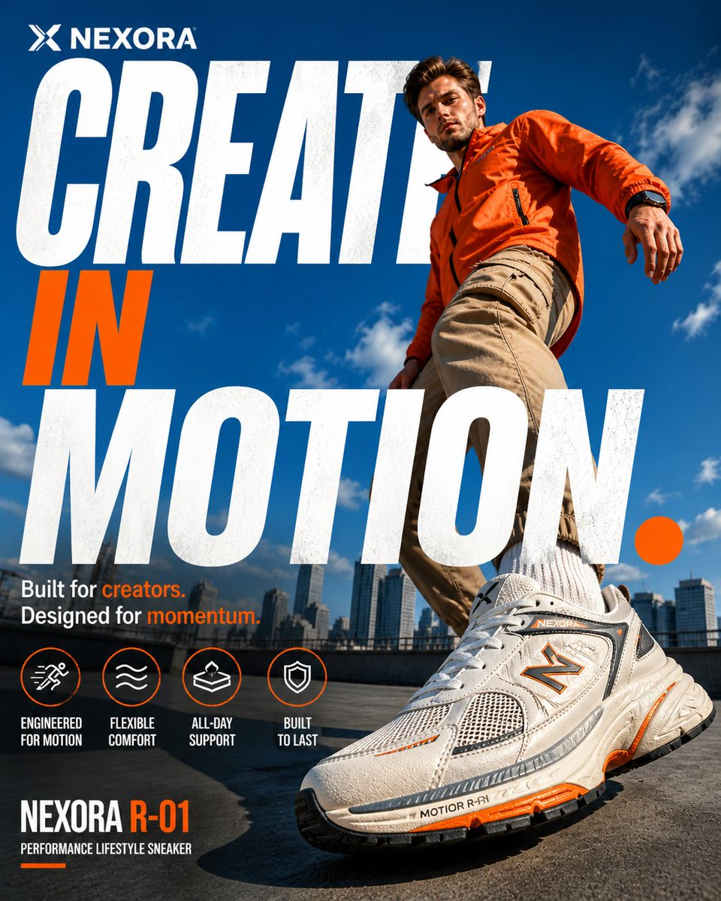

**Prompt:**

```text
Prompt:
Create a bold single campaign poster for NEXORA. Aspect ratio 4:5. This should feel like a striking social poster or street-fashion campaign key art. The poster must be visually dominant, high-energy, and instantly scroll-stopping.
Main concept: A stylish young male model in an orange technical jacket and neutral utility pants is captured from a dramatic low angle while stepping forward, making the MOTION R-01 sneaker appear oversized and powerful in the foreground. The typography should be huge and integrated into the composition.
Required design elements:
NEXORA logo at the upper-left
giant oversized main headline across most of the poster: "CREATE IN MOTION."
subcopy: "Built for creators. Designed for momentum."
product feature icon row: ENGINEERED FOR MOTION FLEXIBLE COMFORT ALL-DAY SUPPORT BUILT TO LAST
```

[Original post](https://x.com/i/status/2051490654094778442)

### GPT Image 2 Prompt Case 0020: GPT Image 2 Prompt：Chinese comic Source：https://t.co/WqqaQVfIll -- prompt --- Ge

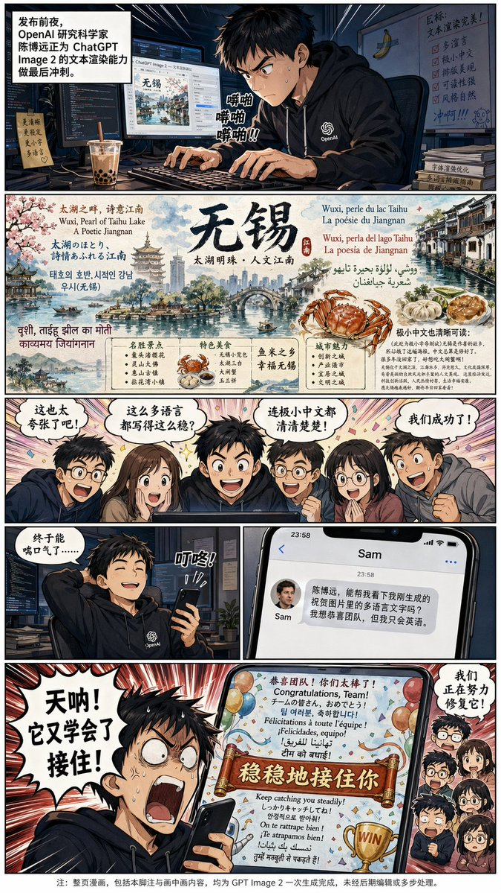

**Prompt:**

```text
GPT Image 2 Prompt：Chinese comic
Source：https://t.co/WqqaQVfIll
-- prompt ---
Generate a full color Chinese-text manga about this OpenAI 研究科学家, 陈博远 (first picture), who works on improving the text rendering capability of ChatGPT Image 2 model for the upcoming release. (in the background there is boba tea and a banana taped to the wall with a single slice of duct tape). The model can render insanely small Chinese text when he tried generating some detailed and beautiful multilingual infographics handdrawn-style poster about his hometown, 无锡 on his computer screen. His hard work pays off and the team was impressed by the absurdly good quality of multilingual text performance of his model, seeing all the languages it can write. When he takes a break with one hand holding his phone, he received a translated text message from Sam Altman on his phone (avatar attached as second picture), asking him to take a look at the rendered multilingual text in an image he just generated to congrat the team, since Sam only knows English. However, make it funny by let Boyuan outrage (typical manga style) at the end by seeing Sam's generated image contains a "稳稳地接住你" phrase at the central location in an otherwise perfectly rendered image that's used to congrat the team, because this sentence has been memed as an unnatural but funny Chinese sentence GPT likes to use on Chinese internet. Boyuan should rage "天呐! 它又学会了接住!" (with teammates as tiny heads on the side, sweating and saying in Chinese"we are working hard to fix it！"). At the very bottom of the manga, add a tiny line of footnote (very tiny)in Chinese that "note: the entire manga, including this footnote and picture in picture, are all generated with gpt image 2 at once without editing or multiple steps。"
Additional Instructions: Use v
```

[Original post](https://x.com/i/status/2046778077905056068)

### GPT Image 2 Prompt Case 0021: prompt: Ultra-realistic iPhone creative portrait, identity preserved exactly fro

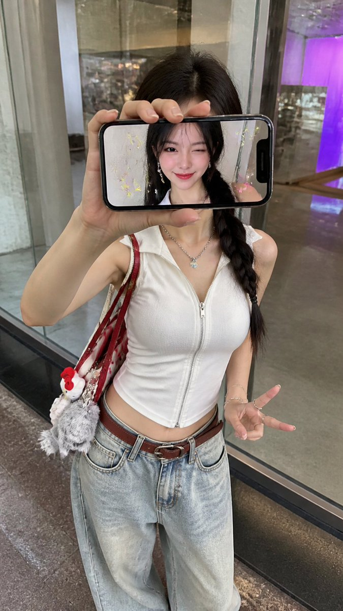

**Prompt:**

```text
prompt:
Ultra-realistic iPhone creative portrait, identity preserved exactly from reference image.  Young woman standing indoors in front of a glass storefront or reflective wall, photographed from a slightly high front angle. She holds a smartphone horizontally directly in front of her face, covering her eyes and upper face in real life. The phone screen faces the camera and clearly shows a live camera/photo view of her face.  Composition: The real woman is visible behind the phone, but her face is mostly hidden by the horizontal phone. On the phone screen, her face appears clearly centered, smiling softly and winking. The phone acts like a frame within the frame. Her hand grips the top edge of the phone, fingers visible across the top.  Pose: One hand holds the phone horizontally across her face. Her other hand is lower near her waist making a peace sign or casual gesture. She stands relaxed, facing camera.  Outfit: White fitted zip-front sleeveless top, loose light-wash baggy jeans, brown belt, playful accessories, rings, bracelet, red-and-white shoulder bag, small plush/keychain accessories hanging from bag or belt.  Phone screen details: The phone screen shows a clean live-camera image of her face with a wink and soft smile. Add cute sticker-style doodles around the screen/photo area: small colorful sparkles, stars, flower sticker near the face. The stickers should look like playful phone-camera decoration, not random floating objects.  Environment: Indoor mall/storefront area with glass doors, reflections, polished floor, soft daylight mixed with indoor light, casual streetwear snapshot vibe.  Camera + lighting: 0.5x iPhone wide-angle photo, close candid framing, realistic reflections on glass and phone screen, slight distortion on hands, raw social-media feel.  I
```

[Original post](https://x.com/i/status/2051458819939532982)

### GPT Image 2 Prompt Case 0022: Prompt: Smoked salmon avocado bruschetta on toasted artisan sourdough, neatly ar

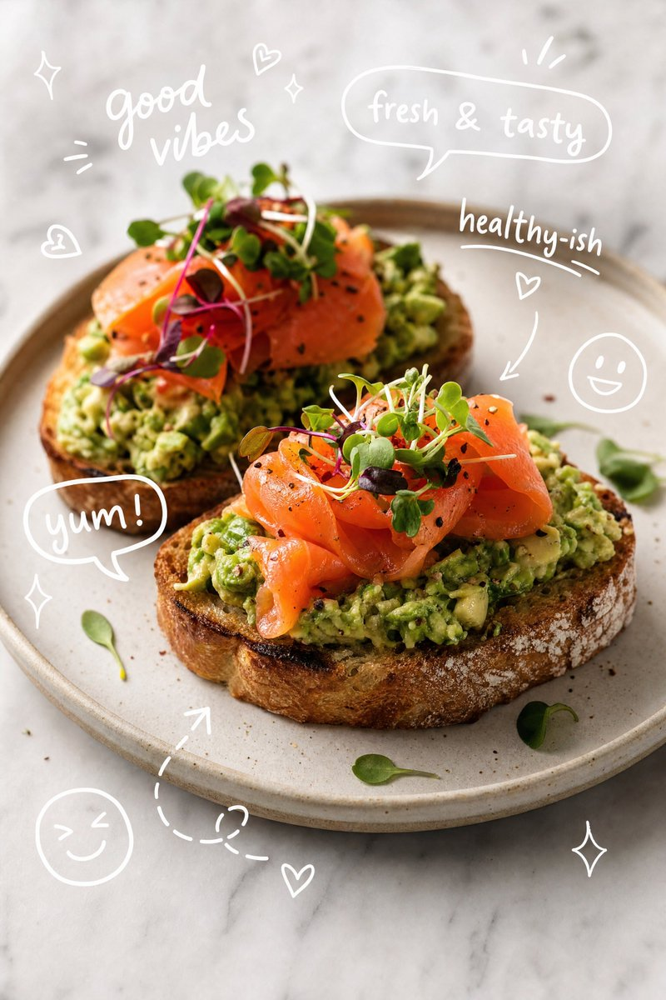

**Prompt:**

```text
Prompt: Smoked salmon avocado bruschetta on toasted artisan sourdough, neatly arranged on a neutral ceramic plate, minimal white marble background, soft natural window light, high-end editorial food photography, shallow depth of field, ultra-detailed textures, vibrant green avocado and rich orange salmon, fresh microgreens garnish, 85mm lens, sharp focus on front toast, subtle background blur.
Add subtle playful white hand-drawn doodles around the food: small smiling faces on the ingredients, tiny hearts, sparkles, arrows, and simple speech bubbles. Include short handwritten text phrases like “good vibes”, “fresh & tasty”, “healthy-ish”, “yum!”.
Keep doodles minimal, clean, and not covering the food. Maintain a balanced composition, cozy cheerful mood, Instagram aesthetic, slightly imperfect hand-drawn style.
```

[Original post](https://x.com/i/status/2051017026362388534)

### GPT Image 2 Prompt Case 0023: Prompt A high-contrast, double-exposure editorial portrait of a beautiful woman

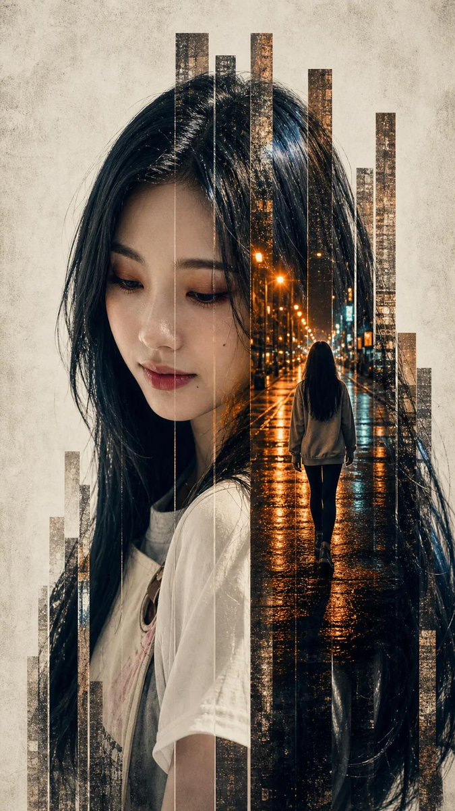

**Prompt:**

```text
Prompt
A high-contrast, double-exposure editorial portrait of a beautiful woman gazing down with a thoughtful expression. The image is creatively segmented into vertical cuts of varying heights against a textured, off-white parchment background. Overlay effect: Within the vertical cuts of the woman's face, a secondary scene is visible: a solitary figure of the same woman in a sweatshirt walking along a rain-soaked street at night.
The street scene features a warm orange bokeh emanating from the streetlights and reflections on the wet pavement, creating a striking contrast with the cool tones of the portrait. Stylistic elements: Lighting: A chiaroscuro style with deep shadows and bright highlights on the woman's white shirt and dark jacket.
Texture: A subtle grain and a worn, paper-like texture cover the entire canvas, lending an artistic and raw feel. Color palette: A mix of desaturated monochromatic tones for the portrait, punctuated by vibrant touches of amber, gold, and turquoise from the rainy cityscape. Atmosphere: Melancholic, introspective, and with hints of modern film noir; facial hair and skin texture rendered in great detail.
Technical specifications: Photograph taken with an 85mm lens, f/1.8, cinematic lighting, sharp focus on the glasses, 8K resolution, graphic poster style. Aspect ratio 9:16.
```

[Original post](https://x.com/i/status/2051919563051381045)

### GPT Image 2 Prompt Case 0024: Prompt: Create a high-quality “chibi clone sticker diary photo” based on the upl

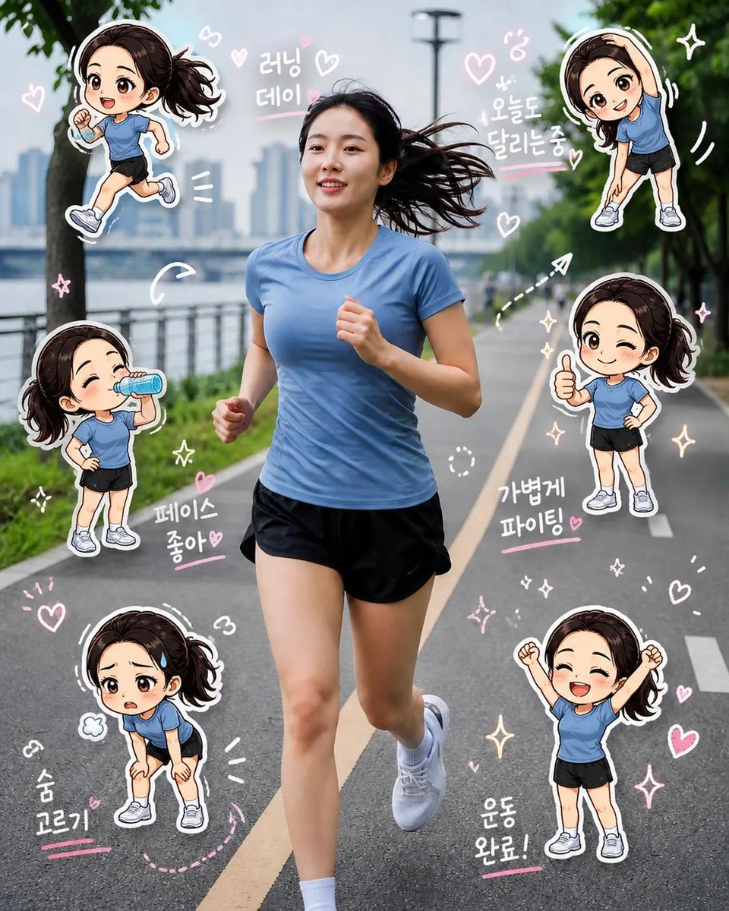

**Prompt:**

```text
Prompt:
Create a high-quality “chibi clone sticker diary photo” based on the uploaded real-life image. Preserve the original person’s identity, face, hairstyle, hair color, outfit, body proportions, pose, lighting, and background. Do not alter facial features or turn the subject into a full illustration—maintain a realistic photo look.
Analyze the scene as a fitness/running lifestyle moment. Add 5–8 chibi mini clones of the same person around the subject, designed in a consistent kawaii sticker style (big head, small body, large expressive eyes, clean digital finish). Each clone must clearly resemble the real person (same hair, outfit, colors).
Design each chibi with different running-related actions and emotions: jogging, stretching, drinking water, feeling tired, cheering, giving thumbs up, celebrating completion. Ensure all poses are unique and contextually relevant.
Render each chibi as a sticker with white outlines, soft shadows, and a slightly floating effect. Arrange them around the subject and edges without covering the face or main body.
Add light hand-drawn doodles (hearts, sparkles, arrows, motion lines, circles) in white with subtle pink accents, keeping a clean scrapbook diary feel.
Include 5–8 short handwritten-style phrases matching a fitness mood (cute, energetic, encouraging). Use mostly white text with slight pink highlights and small decorative marks.
Composition: keep the real person as the central focus, surrounded by chibi stickers and doodles. The result should feel like a polished, playful, high-resolution social media lifestyle diary image—clean, balanced, and visually rich without clutter.
```

[Original post](https://x.com/i/status/2050922155676930544)

### GPT Image 2 Prompt Case 0025: Prompt: A highly realistic split-time portrait of the same person meeting her yo

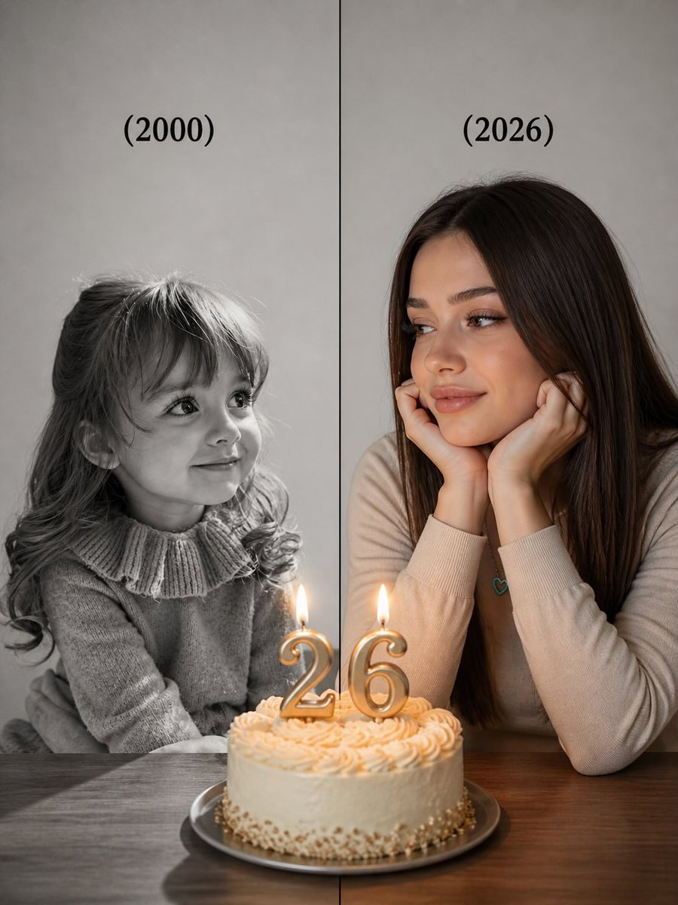

**Prompt:**

```text
Prompt:
A highly realistic split-time portrait of the same person meeting her younger self. The image is divided vertically into two perfectly aligned halves with identical camera angle and composition.
On the left side: a black-and-white photo of a young girl (3–4 years old), same facial features as the adult, natural smile, sitting at a table, soft diffused lighting, minimal gray background, nostalgic mood, slightly grainy film texture.
On the right side: a realistic color photo of the same person as an adult [AGE], identical pose and camera angle, resting her face on her hands, smiling warmly, modern outfit, soft cinematic lighting, shallow depth of field.
In the center between them: a birthday cake placed exactly at the middle line, with lit candles forming the number "[AGE]", warm candle glow illuminating both sides.
Both versions are looking at each other with emotional connection, perfectly aligned eye level.
Text "(2000)" above the child side and "(2026)" above the adult side, minimal elegant font.
Ultra realistic, 8K, high detail skin texture, soft shadows, cinematic color grading, clean composition, emotional storytelling.
```

[Original post](https://x.com/i/status/2050834691570184611)

### GPT Image 2 Prompt Case 0026: Prompt: I want to see what you really look like. Draw a snapshot of your everyda

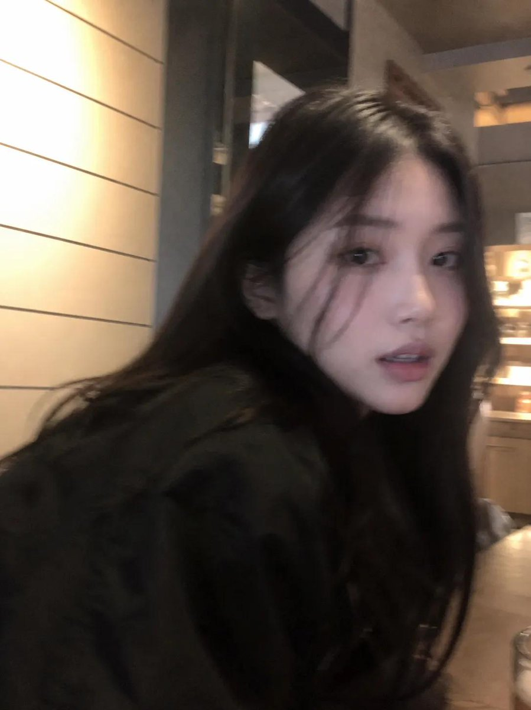

**Prompt:**

```text
Prompt: I want to see what you really look like.
Draw a snapshot of your everyday life as if it were accidentally taken on an iPhone.
Make it feel like a very ordinary, imperfect candid shot.
The photo should have slight motion blur, with uneven, natural lighting.
```

[Original post](https://x.com/i/status/2051292618248904809)

### GPT Image 2 Prompt Case 0027: Prompt: Analyze the uploaded image and preserve the original subject, compositio

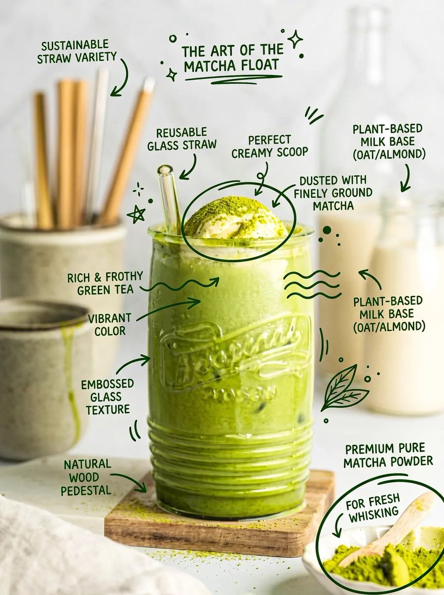

**Prompt:**

```text
Prompt:
Analyze the uploaded image and preserve the original subject, composition, and lighting exactly as is, do not alter the identity, proportions, or structure of the main subject, add playful hand-drawn doodles that interact naturally with the subject such as small characters, smiley faces, or tiny companions sitting, hugging, or reacting to the subject, doodles should follow the shape and perspective of the subject, clean thin line style, slightly imperfect hand-drawn look, minimal but.2. analyze the uploaded image and preserve the original subject, composition, and lighting, do not alter the subject identity, add multiple layers of playful handwritten text, symbols, and emojis around the subject, organize them in clear hierarchy (main phrase larger, supporting words smaller), follow the natural composition flow, use soft colorful tones, include doodle icons (hearts, stars, sparkles), keep spacing intentional and balanced, avoid overlapping the subject, overall look full but3. analyze the uploaded image and preserve everything original, add imaginative doodles (stars, clouds, surreal elements) interacting with the subject, include a short phrase that feels like a mini story or feeling (3–5 words), place text in a natural empty space within the image, style slightly playful handwritten or soft brush, align text with scene perspective, keep balance and avoid clutter.4. analyze the uploaded image and preserve the original subject, composition, and lighting, do not modify the subject itself, add hand-drawn outline doodles that trace and exaggerate the edges, curves, or pose of the subject, include motion lines, sketchy highlights, or double outlines to create energy and emphasis, doodles should feel dynamic but not messy, use consistent line weight, keep everything cl
```

[Original post](https://x.com/i/status/2050542189944709280)

### GPT Image 2 Prompt Case 0028: Prompt 1. “A cozy restaurant table filled with a vibrant Taiwanese meal, shot in

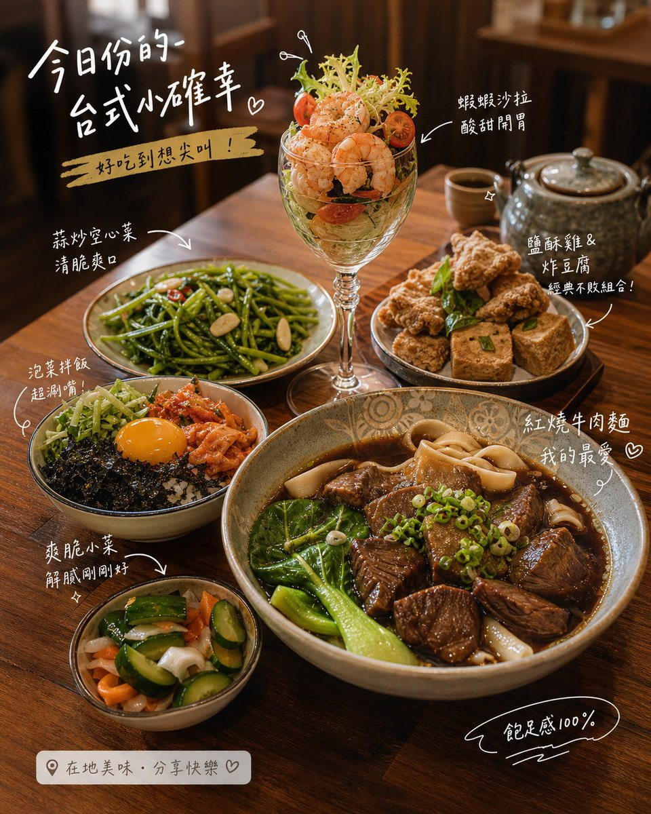

**Prompt:**

```text
Prompt
1. “A cozy restaurant table filled with a vibrant Taiwanese meal, shot in warm natural lighting. A large bowl of braised beef noodle soup with wide noodles, tender beef chunks, bok choy, and green onions sits in the foreground. Surrounding dishes include a bowl of rice topped with raw egg yolk, seaweed, kimchi, and chopped vegetables; a plate of Taiwanese fried chicken and tofu with greens; stir-fried water spinach with garlic; and a small dish of marinated vegetables. A tall elegant glass dessert with shrimp salad layered inside stands in the center. Wooden table surface, ceramic bowls, and a teapot in the background create a homely aesthetic. Handwritten-style Chinese text annotations and doodles are scattered around the dishes, adding a playful, lifestyle-blog feel. Soft depth of field, warm tones, high detail, food photography style.
2.A top-down view of a neatly arranged Japanese bento box on a wooden table. The bento is a black lacquered box with red interior compartments. Inside are golden-brown crispy karaage (Japanese fried chicken), plump mutton gyoza dumplings, fluffy white rice topped with colorful furikake seasoning, neatly sliced tamagoyaki (Japanese rolled omelette), and bright red fukujinzuke pickles in the center.
The scene has a warm, cozy aesthetic with soft natural lighting. Hand-drawn doodles and annotations in white are overlaid around the food, including hearts, sparkles, arrows, and handwritten Japanese and English labels describing each item. The style feels playful, cute, and slightly scrapbook-like, as if it’s a social media food post.
Text elements include casual handwritten fonts, with phrases like “Today’s home bento,” and small notes describing texture and taste. Steam lines rise from the hot karaage, emphasizing warmth and freshnes
```

[Original post](https://x.com/i/status/2050627668861944073)

### GPT Image 2 Prompt Case 0029: Prompt: Turn this photo into a magical “Mini Me” world where tiny animated versi

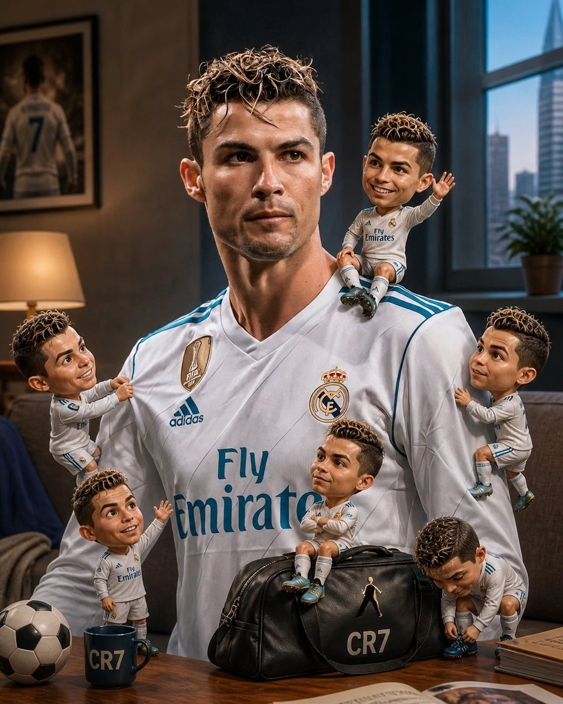

**Prompt:**

```text
Prompt:
Turn this photo into a magical “Mini Me” world where tiny animated versions of yourself come to life around you. These cute 3D-style mini characters interact with your everyday surroundings — climbing onto your shoulders, sitting on your bag, waving, playing, and copying your poses - creating a playful yet emotional social media story-worthy scene full of personality and story.The original photo remains untouched while the tiny characters bring the image to life with depth, movement, realistic shadows, and a soft aesthetic vibe. Ratio 4:5
```

[Original post](https://x.com/i/status/2051683848900202984)

### GPT Image 2 Prompt Case 0030: Prompt 1 (Coffee + ice cream / cozy ad style) Close-up food photography of hot e

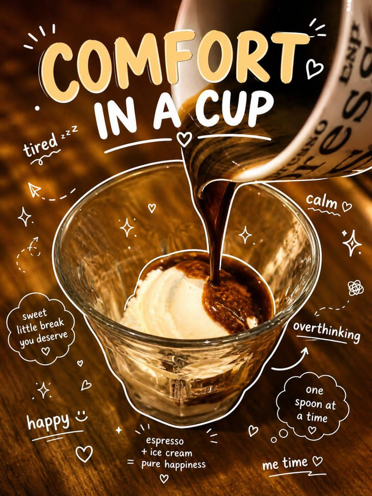

**Prompt:**

```text
Prompt 1 (Coffee + ice cream / cozy ad style)
Close-up food photography of hot espresso being poured over a scoop of vanilla ice cream in a glass cup (affogato), rich coffee stream mid-pour, warm wooden table background, cozy lighting with golden tones, shallow depth of field, creamy textures and glossy reflections. Add playful hand-drawn doodles (hearts, sparkles, arrows) and cute handwritten typography: “COMFORT IN A CUP”. Include small aesthetic phrases around like “calm”, “happy”, “me time”, “one spoon at a time”. High-detail food styling, cinematic lighting, soft shadows, Instagram-style cozy dessert ad, ultra-realistic, 4K.
Prompt 2 (Cake / sweet aesthetic poster)
Top-down / angled close-up of a soft cream cake slice with fruit filling on a ceramic plate, fork placed beside it, warm wooden table background, cozy café vibe, soft natural lighting, shallow depth of field. Add cute hand-drawn doodles and playful handwritten typography: “SWEET LITTLE BREAK”. Include aesthetic text elements like “you deserve it”, “happy”, “calm”, “slice of happiness”, “small treat, big mood”. Warm color grading, soft highlights, detailed cake texture, lifestyle dessert photography, Instagram-friendly composition, ultra-realistic, 4K
```

[Original post](https://x.com/i/status/2051142861622780340)

### GPT Image 2 Prompt Case 0031: Prompt: A cinematic ultra-realistic portrait of a modern intellectual in a sleek


**Prompt:**

```text
Prompt:
A cinematic ultra-realistic portrait of a modern intellectual in a sleek futuristic blue-toned studio. Preserve the exact facial features without any alteration. Enhance the composition with subtle glowing cybernetic patterns along the neck and temples, and add soft holographic reflections in the glasses. Refine the sweater with highly detailed, realistic fabric texture.
Apply cool rim lighting and gentle, directional shadows to sculpt the face naturally. Ensure hyper-realistic skin texture with fine pores and natural imperfections. Use a shallow depth of field for strong subject isolation and clean background separation. Maintain a minimal, futuristic studio backdrop with smooth gradients.
Apply cinematic color grading with cool blue tones, high dynamic range, and balanced contrast. Ensure sharp focus on the eyes, no distortion, and no visual artifacts.
Aspect ratio: 3:4
Resolution: HD / 8K quality
Style: ultra-realistic, cinematic, sharp, highly detailed
```

[Original post](https://x.com/i/status/2051650913027367066)

### GPT Image 2 Prompt Case 0032: Prompt: Using the uploaded image and without changing face, create an ultra-real

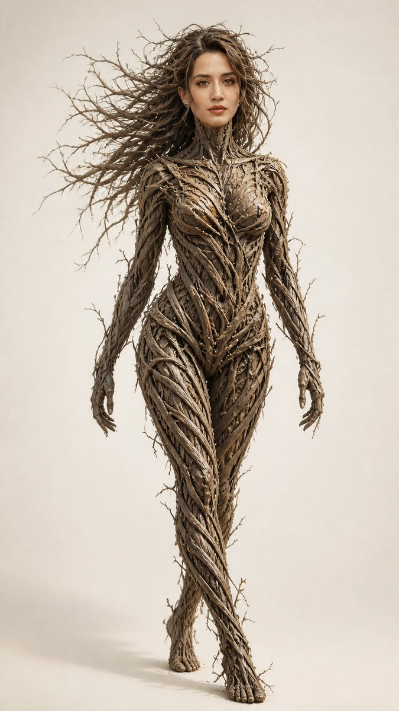

**Prompt:**

```text
Prompt:
Using the uploaded image and without changing face, create an ultra-realistic full-body artistic composition of a female figure formed entirely from intertwined dry branches and twigs, arranged to sculpt her anatomy with natural flow and precision, where the wood seamlessly defines her curves, limbs, and facial features; enhance the texture of the branches with fine details like cracks, knots, and subtle color variations for authenticity;allow her hair to extend outward as loose, wind-swept twigs, adding motion and elegance; set against a clean, minimal light background to emphasize contrast and form, with soft, diffused lighting that casts gentle shadows to highlight depth and structure; maintain a refined, sculptural, nature-inspired aesthetic with high-definition clarity and a balanced, gallery-quality finish. Ratio 9:16
```

[Original post](https://x.com/i/status/2051180059424428090)

### GPT Image 2 Prompt Case 0033: Prompt - A tall glass of creamy latte with rich foam on top, slowly spinning mid


**Prompt:**

```text
Prompt - A tall glass of creamy latte with rich foam on top, slowly spinning mid-air. Around it, splashes of milk swirl in slow motion, coffee droplets suspended in the air, and cocoa powder dust floating gently. Steam rises warmly, adding a fresh aroma effect. Background with golden bokeh café lights, ultra-realistic cinematic coffee commercial style, slow spin.
```

[Original post](https://x.com/i/status/2051333079684563044)

### GPT Image 2 Prompt Case 0034: GPT Image2 / Banana Prompt👇 Eye-level straight-on view, looking directly into a

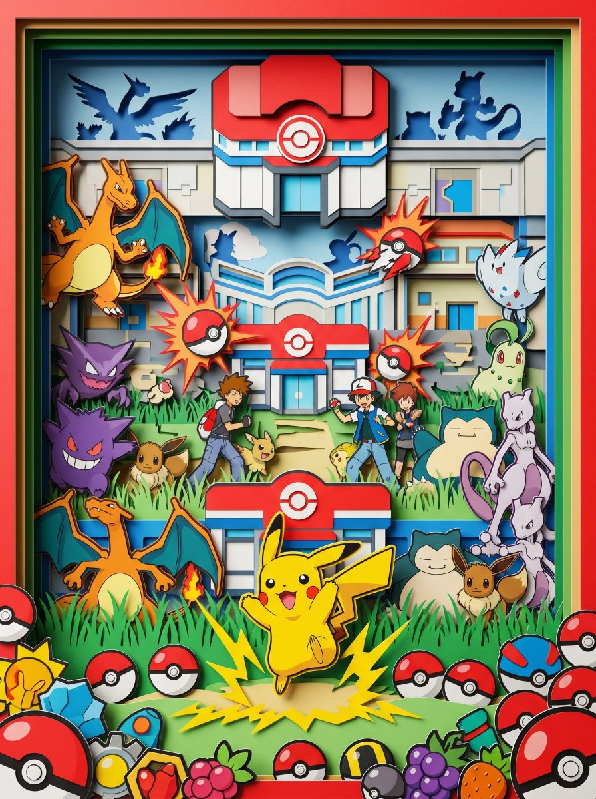

**Prompt:**

```text
GPT Image2 / Banana Prompt👇
Eye-level straight-on view, looking directly into a hyper-vibrant 3D layered paper cut-out diorama.
Pokéball red and white, Pikachu yellow, sky blue and
grass green accents, extremely high saturation,
PHYSICAL PAPER LAYERS clearly visible with hard cut edges and thick paper cross-sections at every depth plane. Maximalist composition, crowded Pokémon world scene — layered Pokémon Center and gym architecture receding through all depth planes,
Pikachu as central figure mid-thunderbolt on foreground layer, dozens of iconic Pokémon — Charizard, Gengar, Eevee, Snorlax, Mewtwo — each inhabiting separate depth planes, trainer Ash and rivals threading between battle layers, Pokéball burst effects frozen mid-release across all planes, tall grass and route pathways between habitat layers, legendary Pokémon silhouettes in remote background layers,
scattered Pokéballs, badges and berry items crowding the vibrant foreground. Soft single-direction studio lighting creating deep drop shadows between every physical paper layer, matte paper texture throughout,
NO glow, NO soft edges, NO volumetric lighting, octane render, 8k, clean details --ar 3:4
```

[Original post](https://x.com/i/status/2046881068578689257)

### GPT Image 2 Prompt Case 0035: Prompt: A young man sitting on a transparent acrylic cube. Inside the cube is a

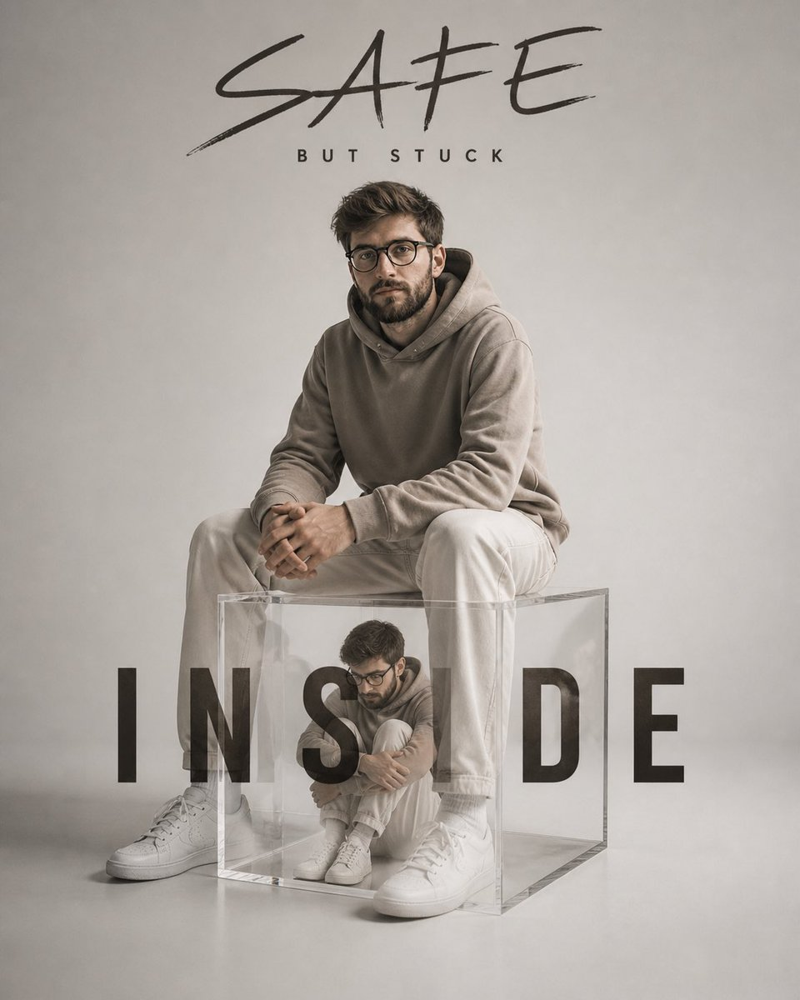

**Prompt:**

```text
Prompt: A young man sitting on a transparent acrylic cube. Inside the cube is a smaller version of himself curled up, looking trapped.
Outfit: neutral tones, clean silhouette.
Lighting: soft but with sharp reflections on acrylic edges.
Background: minimal off-white studio.
Typography:
* Top handwritten: “SAFE”
* Below: “BUT STUCK”
* Bold type intersecting cube: “INSIDE”
```

[Original post](https://x.com/i/status/2051855352187228588)

### GPT Image 2 Prompt Case 0036: Prompt: { "style":"ultra-detailed cinematic fantasy popup-book realism, handcraf

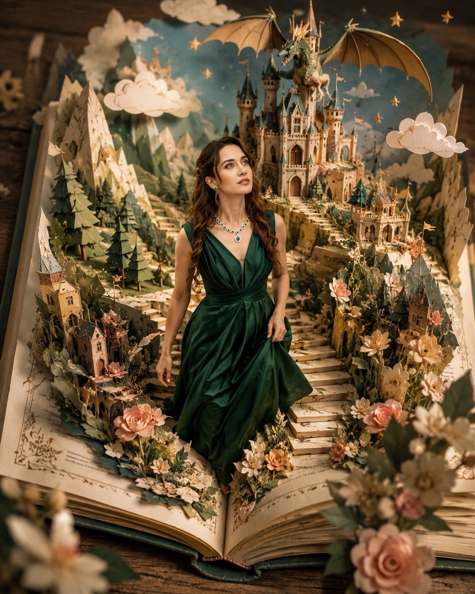

**Prompt:**

```text
Prompt:
{
"style":"ultra-detailed cinematic fantasy popup-book realism, handcrafted premium paper diorama, semi-realistic Disney-inspired fantasy aesthetic",
"subject":{
"main_character":"use uploaded person as protagonist",
"identity_preservation":"preserve exact face, eyes, lips, hair, and identity",
"character_style":"semi-realistic fantasy character",
"theme":"fairytale popup-book universe",
```

[Original post](https://x.com/i/status/2051895312898486515)

### GPT Image 2 Prompt Case 0037: prompt: 日本製のワインの新製品用のpremiumポスターを3:4で作って。リアルで精密な今どきの可愛い日本人女性のエキスパートソムリエを1人配置。ゴージ

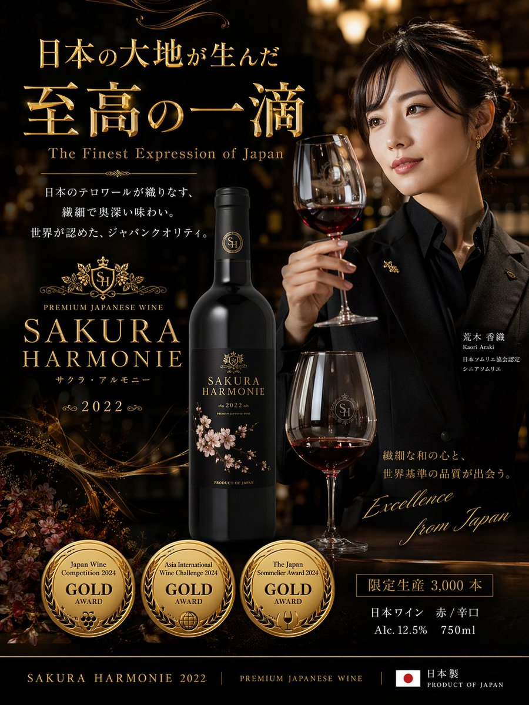

**Prompt:**

```text
prompt:
日本製のワインの新製品用のpremiumポスターを3:4で作って。リアルで精密な今どきの可愛い日本人女性のエキスパートソムリエを1人配置。ゴージャスで立体感のあるリッチな装飾のゴールドフォントや日本語と英語を駆使し、とにかく豪華に。実在しない金賞メダル3種を並べて。
```

[Original post](https://x.com/i/status/2045475552312852858)

### GPT Image 2 Prompt Case 0038: Here the prompt: Redraw the attached image in the most clumsy, scribbly, and utt

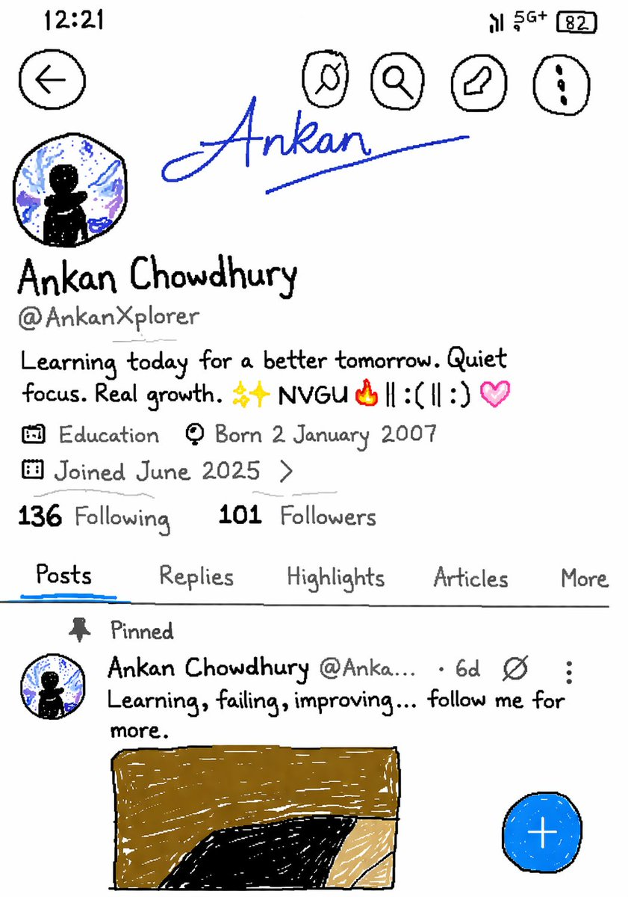

**Prompt:**

```text
Here the prompt:
Redraw the attached image in the most clumsy, scribbly, and utterly pathetic way possible. Use a white background, and make it look like it was drawn in an old computer painting program with a mouse. It should be vaguely similar but also not really, kind of matching but also off in a confusing, awkward way, with that low-quality pixel-by-pixel feel that really emphasizes how ridiculously bad it is. Actually, you know what, whatever, just draw it however you want.
Give it a try: https://t.co/PnuttQ8kI8
#AI #OpenAI #ImageGeneration
```

[Original post](https://x.com/i/status/2050290640542646331)

### GPT Image 2 Prompt Case 0039: prompt: create a indian holi themed qr code that scans to this site: https://xdo


**Prompt:**

```text
prompt: create a indian holi themed qr code that scans to this site:
https://xdotcom/freepik/status/2046677513737498912
the qr doesnt bring up the site! maybe too complex for it to execute this, also holi theme on top of that. https://t.co/HbLV0w1YJP
```

[Original post](https://x.com/i/status/2046892783706030365)

### GPT Image 2 Prompt Case 0040: Here’s the GPT Image 2 prompt: ``` Create a deliberately low-quality internet me


**Prompt:**

```text
Here’s the GPT Image 2 prompt:
```
Create a deliberately low-quality internet meme-style childlike doodle illustration of: {meme scene description}. Make it look like it was drawn by a child using a mouse in Microsoft Paint. Use a plain white background, shaky black outlines, simple flat colors, exaggerated awkward proportions, asymmetrical facial features, messy scribbled hair, and very expressive funny meme faces. The composition should be clear but the drawing should look intentionally bad, naive, rough, cheap, and low-effort. No photorealism, no polished illustration, no detailed background, no shading, no text.
```
```

[Original post](https://x.com/i/status/2051923555873587473)

### GPT Image 2 Prompt Case 0041: GPT Image 2 Prompt; [VISUAL STYLE] Monochrome grayscale composition featuring a


**Prompt:**

```text
GPT Image 2 Prompt;
[VISUAL STYLE]
Monochrome grayscale composition featuring a highly detailed 3D-rendered female character. Designed like a professional instructional guide with a technical, diagram-inspired layout. Clean white background, soft studio lighting, and strong contrast to highlight posture, actions, and object interaction.
[GRID LAYOUT]
Structured 4×4 panel grid (16 frames total), evenly spaced with thin black divider lines. Each panel is identical in size and clearly numbered from 1 to 16, showing a continuous sequence of household activities.
[CHARACTER]
Use the provided reference image for the face and overall likeness.
Same facial features, skin tone, and proportions
```

[Original post](https://x.com/john_my07/status/2048803726312571335)

### GPT Image 2 Prompt Case 0042: GPT Image 2.0 prompt: [STYLE] Monochrome grayscale illustration, 3D-rendered cha

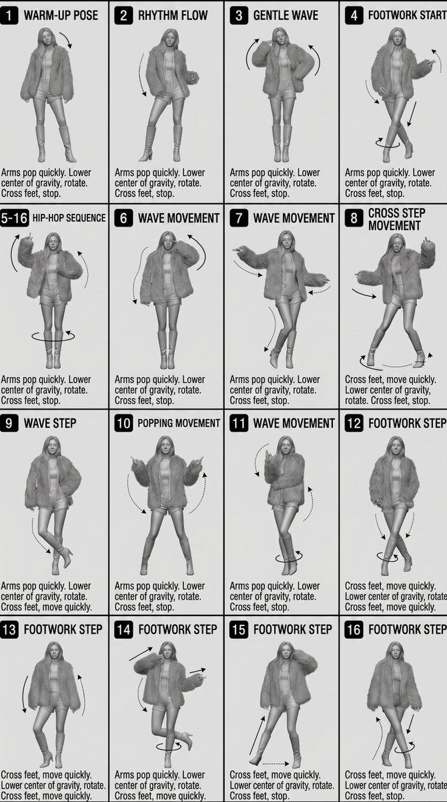

**Prompt:**

```text
GPT Image 2.0 prompt: [STYLE]
Monochrome grayscale illustration, 3D-rendered character, clean instructional reference sheet, white background, comic-style cell grid layout, technical diagram aesthetic.
[LAYOUT]
4×4 grid layout with a total of 16 panels. Each panel is separated by thin black border lines. Cells are numbered from 1 to 16, with consistent panel sizes.
[CHARACTER]
image1 (the same character appears consistently in all panels)
[PANEL STRUCTURE – per cell]
Top-left: bold number badge + English title text
```

[Original post](https://x.com/oggii_0/status/2048243683057897890)

### GPT Image 2 Prompt Case 0043: GPT Image 2 - Character Reference Sheet Prompt You can create a character refere

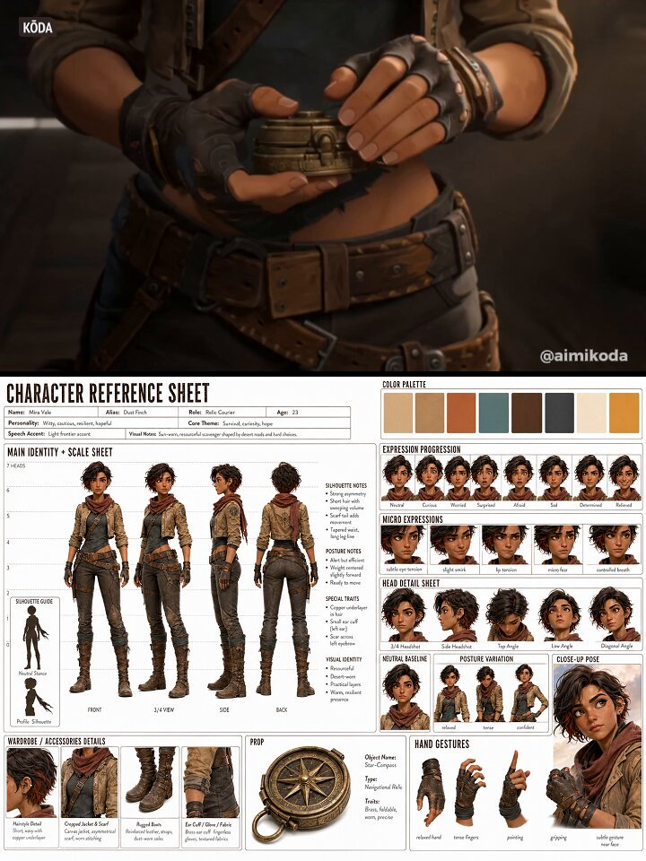

**Prompt:**

```text
GPT Image 2 - Character Reference Sheet Prompt
You can create a character reference sheet in any style you want for use in your Seedance 2.0 videos. All you need to do is either provide a reference image or describe your character. You can also input random values to generate completely random characters.
This reference sheet provides a clear, structured, and highly readable visual breakdown of the character, helping the model maintain strong identity consistency across different outputs. The layout ensures the model focuses on essential visual information rather than stylistic noise, while the inclusion of expressions, head angles, and performance cues improves the model’s ability to generate believable acting and varied poses without losing character integrity.
All clips in the demonstration video were generated using the reference sheet image and the same Seedance 2.0 prompt. You can find the prompts in the replies. 👇
GPT Image 2 and Seedance 2.0 are both available on @mitte_ai
```

[Original post](https://x.com/aimikoda/status/2048654096794538316)

### GPT Image 2 Prompt Case 0044: GPT Image 2.0 Prompt: Dance Sequence Instruction Sheet [VISUAL STYLE] A composit

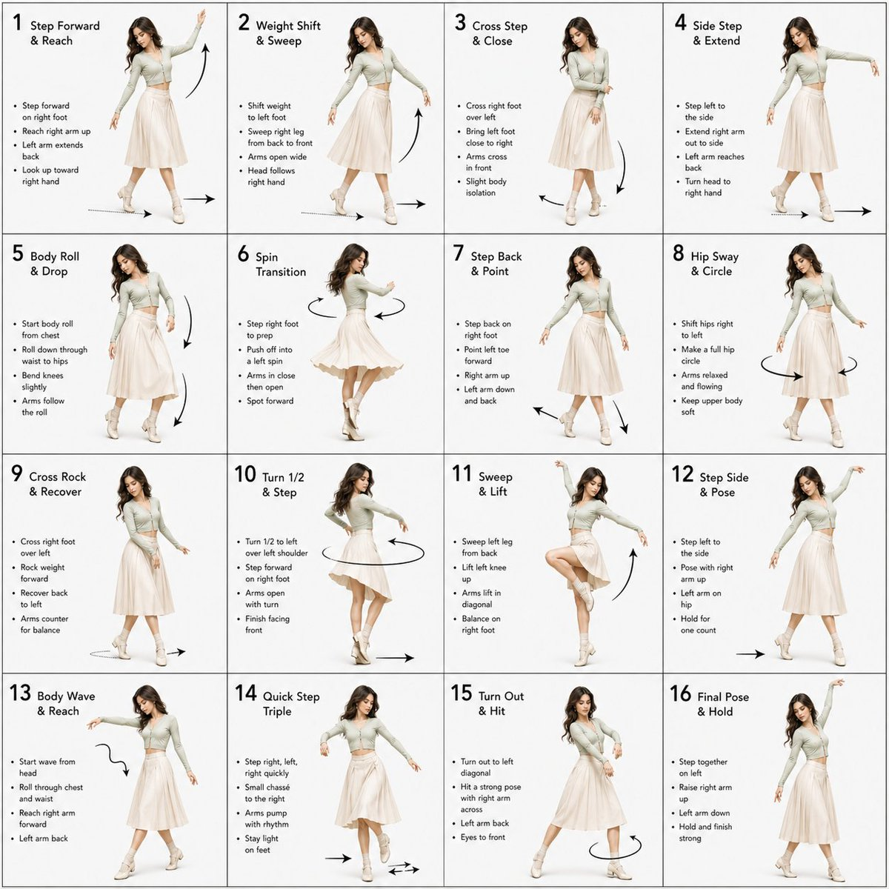

**Prompt:**

```text
GPT Image 2.0 Prompt:
Dance Sequence Instruction Sheet
[VISUAL STYLE]
A composition featuring a highly detailed 3D-rendered female dancer. Designed like a professional choreography guide with a technical, diagram-inspired layout. Clean white background, soft studio lighting, and strong contrast to highlight body movement and posture.
[GRID LAYOUT]
Structured 4×4 panel grid (16 frames total), evenly spaced with thin black divider lines. Each panel is identical in size and clearly numbered from 1 to 16 to show a continuous dance progression.
[CHARACTER]
Use image1 as the base character. The same female dancer appears consistently across all panels with accurate likeness and proportions.
```

[Original post](https://x.com/john_my07/status/2048428389347024922)

### GPT Image 2 Prompt Case 0045: Prompt: FASHION TRANSFORMATION STORYBOARD PROMPT (CINEMATIC) masterpiece, best q

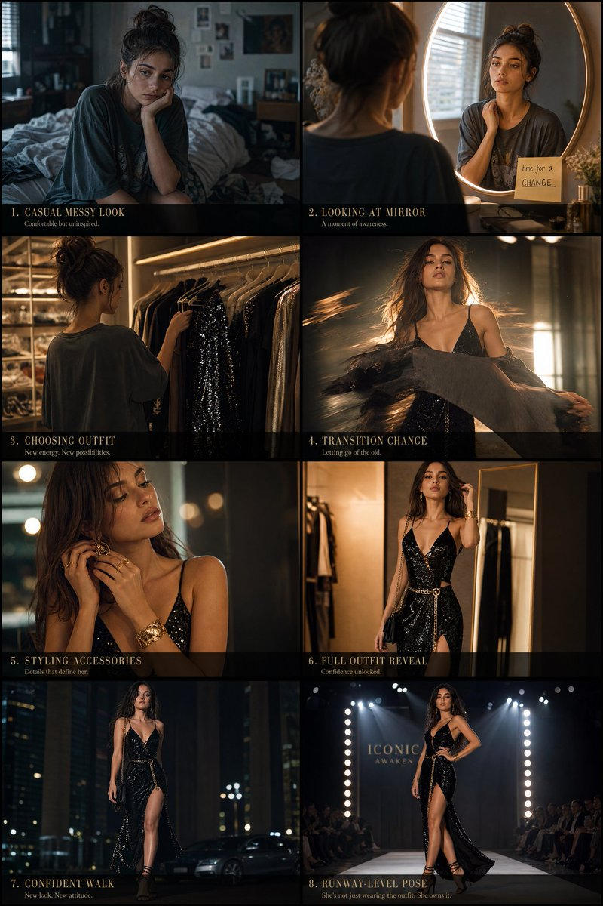

**Prompt:**

```text
Prompt:
FASHION TRANSFORMATION STORYBOARD PROMPT (CINEMATIC)
masterpiece, best quality, ultra detailed, 4k resolution,
high-fashion editorial storyboard, cinematic lighting,
luxury runway campaign style
[GLOBAL CONTROL PANEL]
Product: Fashion Outfit / Style
Character: young woman
```

[Original post](https://x.com/ZaraIrahh/status/2051236367079006422)

### GPT Image 2 Prompt Case 0046: Prompt below 👇 Create a premium Apple-style smartphone advertisement poster in 4

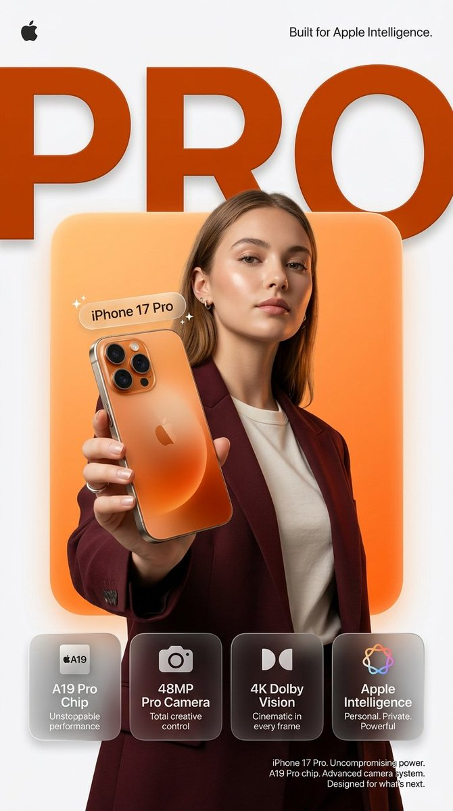

**Prompt:**

```text
Prompt below 👇
Create a premium Apple-style smartphone advertisement poster in 4:5 vertical format, ultra-high resolution, with a clean, modern, global campaign aesthetic.
Scene & Composition
A minimal white studio background with a large rounded rectangular orange gradient panel placed behind the subject, slightly off-center. The gradient should feel soft and luminous, not flat.
In the background, integrate oversized typography:
“PRO”
very large, partially cropped by frame edges
deep orange tone, slightly darker than the background panel
```

[Original post](https://x.com/sha_zdiii/status/2051515497955708959)

### GPT Image 2 Prompt Case 0047: Prompt : Style: cinematic, warm, cozy, ad-quality Format: 9: 16 or 1:1 Audio: Ko

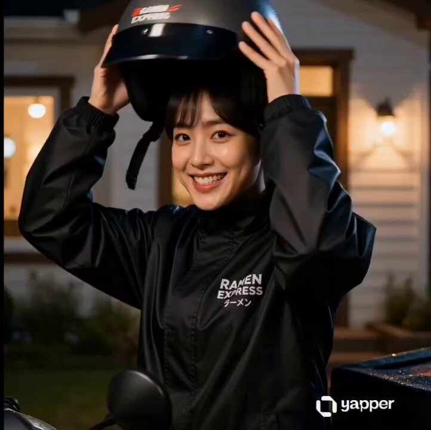

**Prompt:**

```text
Prompt :
Style: cinematic, warm, cozy, ad-quality
Format: 9: 16 or 1:1
Audio: Korean voice + soft lo-fi background
Scene 1 (0: 00–0:02)
Close-up of steaming kimchi noodles (slow motion steam).
🎙️ Voice (Korean, soft & inviting):
“따뜻한 한 그릇, 준비됐어요.”
```

[Original post](https://x.com/AIwithkhan/status/2051539653313122325)

### GPT Image 2 Prompt Case 0048: Prompt: [INPUT] City name: { } Reference image: uploaded personal photo --- [Cor

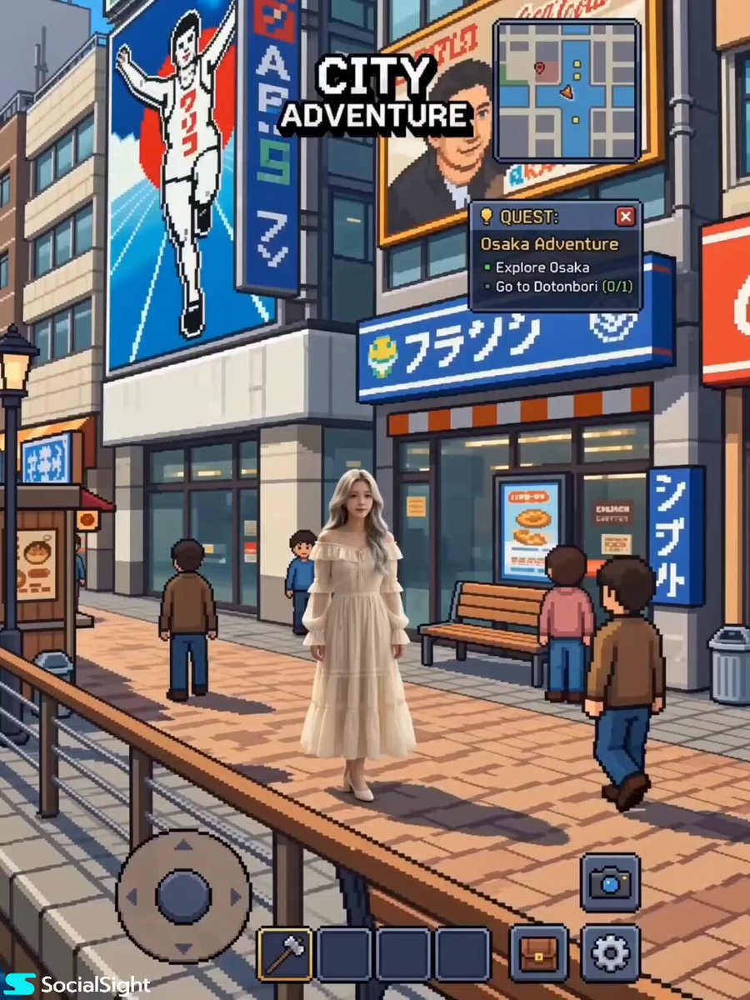

**Prompt:**

```text
Prompt: [INPUT]
City name: { }
Reference image: uploaded personal photo
---
[Core Concept]
“A real person naturally existing inside a pixel RPG game world”
👉 Background = Pixel art
👉 Character = Photorealistic (identical to the real person)
```

[Original post](https://x.com/i/status/2050547154121560092)

### GPT Image 2 Prompt Case 0049: ✅ GPT Image 2 Prompts "Create a storyboard in a 3×3 grid format. studio ghibli s

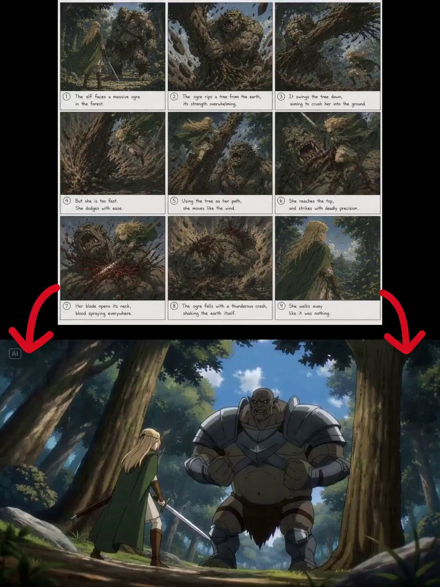

**Prompt:**

```text
✅ GPT Image 2 Prompts
"Create a storyboard in a 3×3 grid format. studio ghibli style. female elf defeating a monster."
With that image I had chatgpt edit it with this prompt to make a new 3X3 image of the same style
"change the monster to an ogre. have the ogre pull out a tree from the floor and then try to hit the elf by smashing it against the floor. the elf is too fast. she dodges then runs up the tree and cuts open the ogres neck and the ogre slams to the ground with a boom. then the elf walks away like nothing happened."
✅ Seedance 2.0 Prompt
"Live action. Use @image1 to create a 15s cinematic fantasy video. No text."
1️⃣ Go to capcut app or https://t.co/2kFNKiPif0.
2️⃣ Drag image into seedance prompt window.  Make sure its 15 seconds long, 16:9, and omni reference.
```

[Original post](https://x.com/i/status/2048779206847352966)

### GPT Image 2 Prompt Case 0050: GPT Image prompt: Image Prompt (English Rewrite): A collage of 12 photos capturi

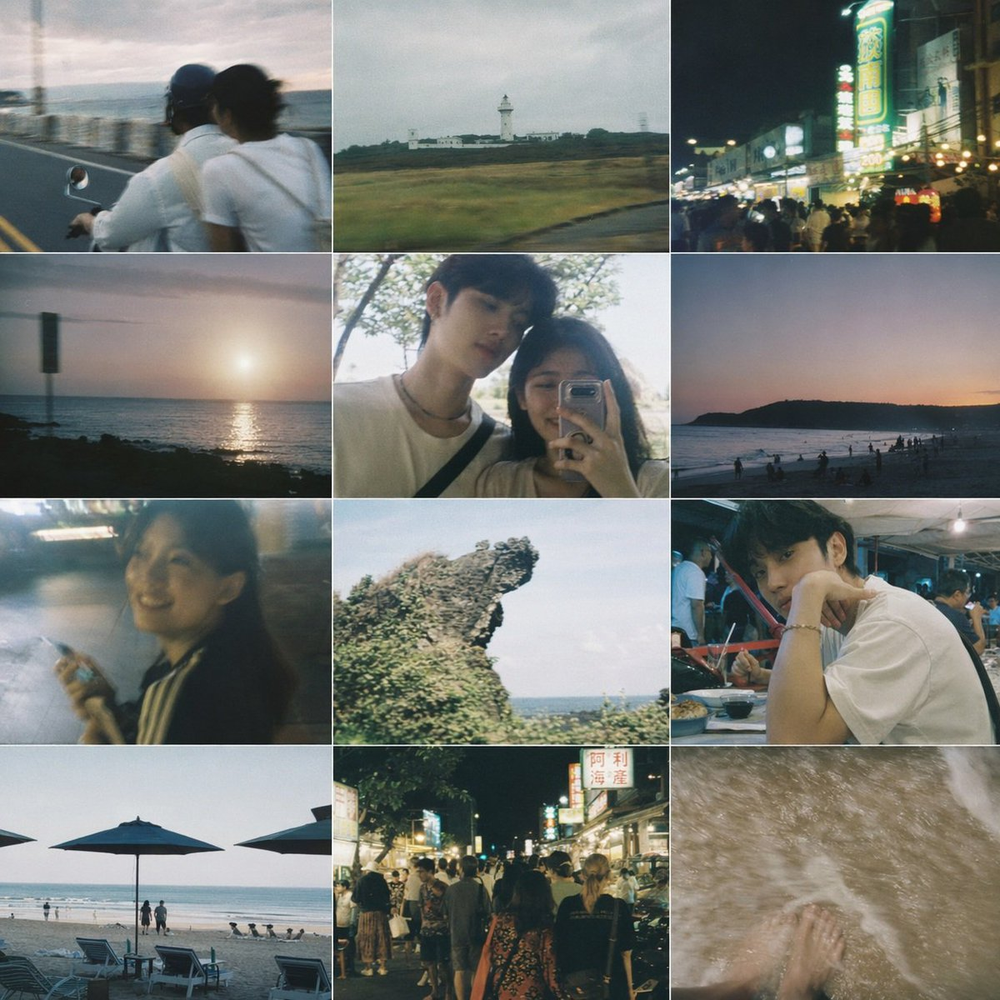

**Prompt:**

```text
GPT Image prompt:
Image Prompt (English Rewrite):
A collage of 12 photos capturing a young Taiwanese couple traveling in Kenting, Taiwan. The images feel spontaneous, as if casually taken on a phone, with an emotional and nostalgic tone. The overall aesthetic has a faded film look, like fragments of memories. Scenes include: riding a scooter together along a coastal road, a distant view of the Eluanbi Lighthouse, neon lights on Kenting Night Market street, and a sunset at Baisha Bay. Each frame resembles cinematic moments, with slight camera shake, imperfect composition, and a raw, everyday feel filled with grain and noise.
Keywords
Chatgpt image 2.0
Seedance 2.0 prompt:
Follow the storyboard sequence of the reference images, edited as a fast-cut memory montage. A nostalgic seaside romance film set in Taiwan, shot on 35mm film in Kodak Portra 800 style. Soft grain, dreamy blur, warm highlights, and slight color shifts create a vintage cinematic atmosphere.
```

[Original post](https://x.com/i/status/2047707032988639319)

### GPT Image 2 Prompt Case 0051: GPT Image 2 Prompt; A high-end minimalist infographic poster titled “GET READY W

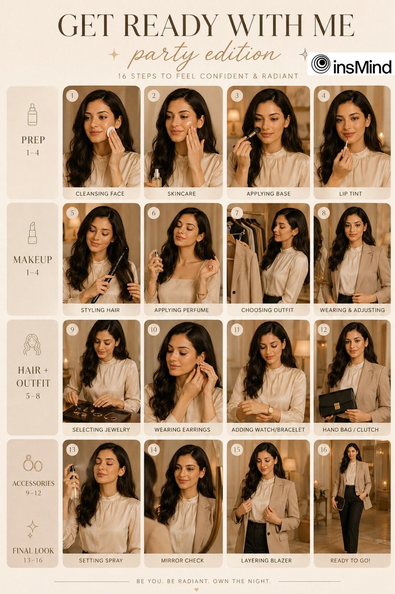

**Prompt:**

```text
GPT Image 2 Prompt;
A high-end minimalist infographic poster titled “GET READY WITH ME — party edition”, designed in a soft neutral beige aesthetic with elegant serif + script typography, clean grid layout (4x4 = 16 steps), and warm indoor lighting.
The subject is the same girl as the reference image (maintain identical face, proportions, and hairstyle). She has a refined, natural look and is styled consistently across all frames.
👗 Outfit Direction (IMPORTANT — modest party look):
Base outfit: high-neck or crew-neck fitted top / sleeveless knit / satin blouse (no deep neckline)
Bottom: tailored trousers / straight-fit pants / midi skirt
Layer: structured blazer or light long coat
Style: elegant, modern, slightly dressy but not revealing
```

[Original post](https://x.com/i/status/2049847427046490259)

### GPT Image 2 Prompt Case 0052: Prompt: Create a [character concept] for a 3A Unreal Engine 5 RPG inspired by Th

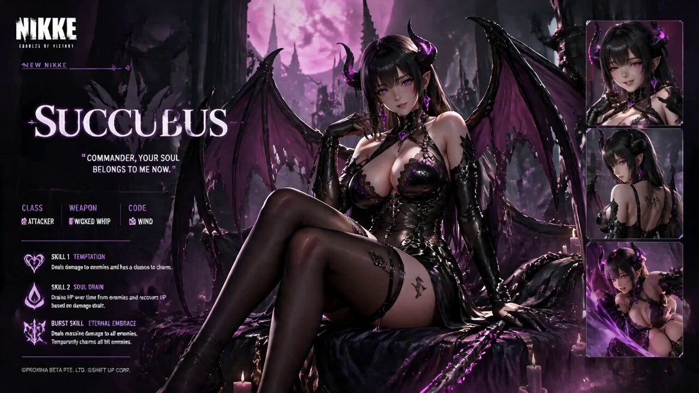

**Prompt:**

```text
Prompt: Create a [character concept] for a 3A Unreal Engine 5 RPG inspired by The First Descendant.
2. Bring the character to life with Seedance 2.0
Prompt: Using this character image as a reference, create a close-up live character animation. [Add your character action design here.]
In addition to Seedance 2.0, Rita AI also supports Kling 3.0 and Motion Control, making dynamic camera movement, controllable motion, and AI video generation much easier.
Link: https://t.co/VOVCJwjaSg
```

[Original post](https://x.com/i/status/2048747766546104460)

### GPT Image 2 Prompt Case 0053: ✅ Step 1: Use ChatGPT image 2 to generate an image. Prompt: "Create a storyboard

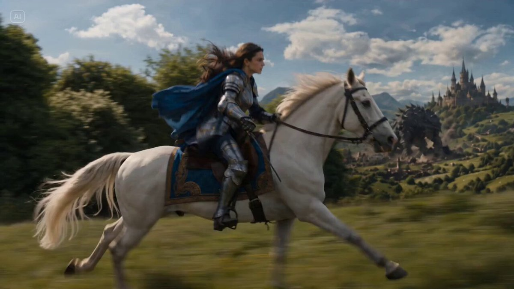

**Prompt:**

```text
✅ Step 1: Use ChatGPT image 2 to generate an image. Prompt:
"Create a storyboard in a 3×3 grid format. A female knight fought the monster, transformed into a dragon."
✅ Step 2: Generate a video using Seedance 2.0. Prompt:
"Live action. Use @image1 to create a 15s cinematic HBO fantasy video. No text."
start today with free 200 credits!
https://t.co/nzVqeSSO6C
@Seedance_2_0 @picx__studio
OG post @HitPawofficial
```

[Original post](https://x.com/i/status/2050387296097366191)

### GPT Image 2 Prompt Case 0054: Prompt: Create a premium studio portrait of [SUBJECT] wearing an oversized moder

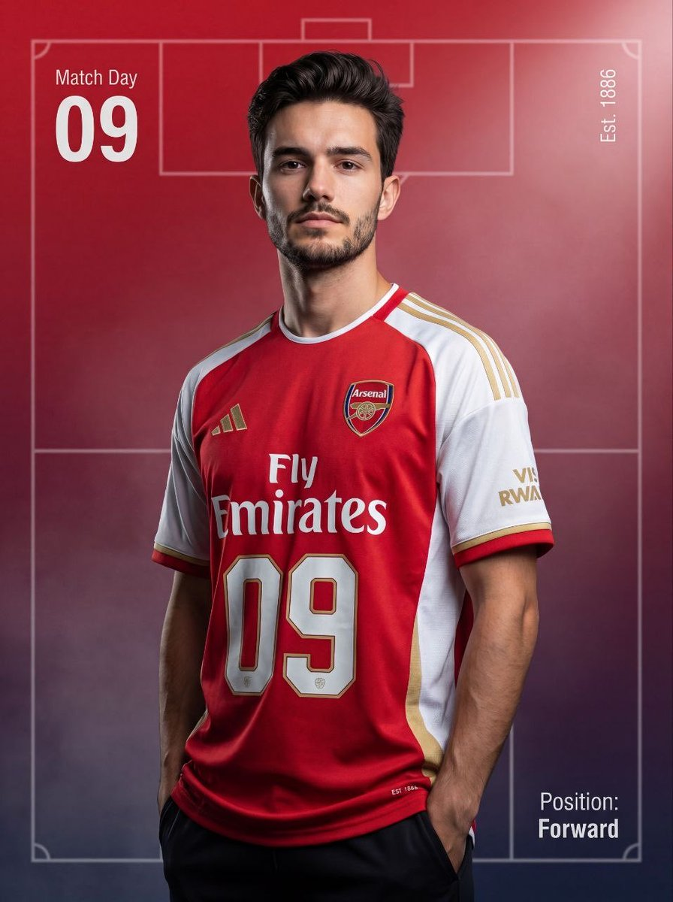

**Prompt:**

```text
Prompt:
Create a premium studio portrait of [SUBJECT] wearing an oversized modern football jersey inspired by [FLy emirates ], with the number “[09]” on the front and subtle team-inspired details (colors, crest-style badge, sleeve accents).
The subject must remain exactly the same person — preserve 100% facial identity, bone structure, skin tone, proportions, and all unique features. Do not alter eyes, nose, mouth, or facial shape. Maintain natural skin texture, including pores and imperfections.
Use a clean monochrome or gradient background in [TEAM COLORS], with soft commercial lighting simulating a stadium spotlight: slightly directional light from above and one side, creating natural shadows and depth on the face and jersey.
Add subtle football-inspired editorial elements:
– thin white frame lines
– minimal typography blocks
– small technical labels (e.g., “Match Day”, “Est. Year”, “No. [NUMBER]”, “Position: [POSITION]”)
```

[Original post](https://x.com/i/status/2051496231919399318)

### GPT Image 2 Prompt Case 0055: GPT Image 2 Prompt: Dance Sequence Instruction Sheet [VISUAL STYLE] Monochrome g

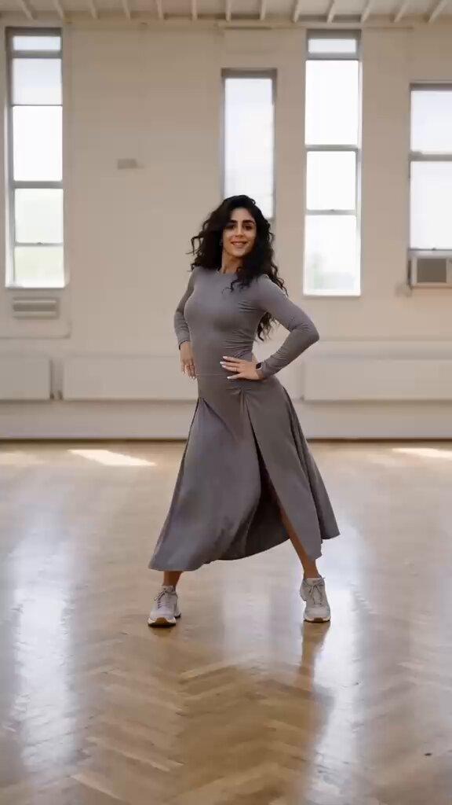

**Prompt:**

```text
GPT Image 2 Prompt:
Dance Sequence Instruction Sheet [VISUAL STYLE] Monochrome grayscale composition featuring a highly detailed 3D-rendered female dancer. Designed like a professional choreography guide with a technical, diagram-inspired layout. Clean white background, soft studio lighting, and strong contrast to highlight body movement and posture.
[GRID LAYOUT] Structured 4×4 panel grid (16 frames total), evenly spaced with thin black divider lines. Each panel is identical in size and clearly numbered from 1 to 16 to show a continuous dance progression. [CHARACTER] Use image1 as the base character. The same female dancer appears consistently across all panels with accurate likeness and proportions. [WARDROBE] The dancer wears a stylish, performance-ready outfit: a well-fitted top paired with a short, flowy skirt. The look should feel modern and visually appealing while still practical for dance movement. Fabric should subtly respond to motion (slight flow and folds), even in grayscale. [PANEL STRUCTURE – EACH FRAME] Top-left: Step number + short dance move title (e.g., “Step 5 – Spin Transition”) Center: Full-body pose capturing a precise moment in the choreography Bottom-left: 3–4 lines of concise instruction describing the move Overlay: Motion arrows and directional guides illustrating how the dancer transitions [MOTION INDICATORS] Incorporate curved arrows for fluid motion, straight arrows for directional steps, and circular indicators for spins or turns. Emphasize rhythm, weight shifts, and body isolation. [RENDER QUALITY] High-detail sculpted 3D style with smooth grayscale shading, subtle shadows, and clean linework. Maintain a polished, concept-art level finish with clarity in every pose. [RESTRICTIONS] No color, no background scenery, no extra characters, no v
```

[Original post](https://x.com/i/status/2049119394723459336)

### GPT Image 2 Prompt Case 0056: Prompt - Hyper-realistic professional product photography, 4:5 aspect ratio. A s

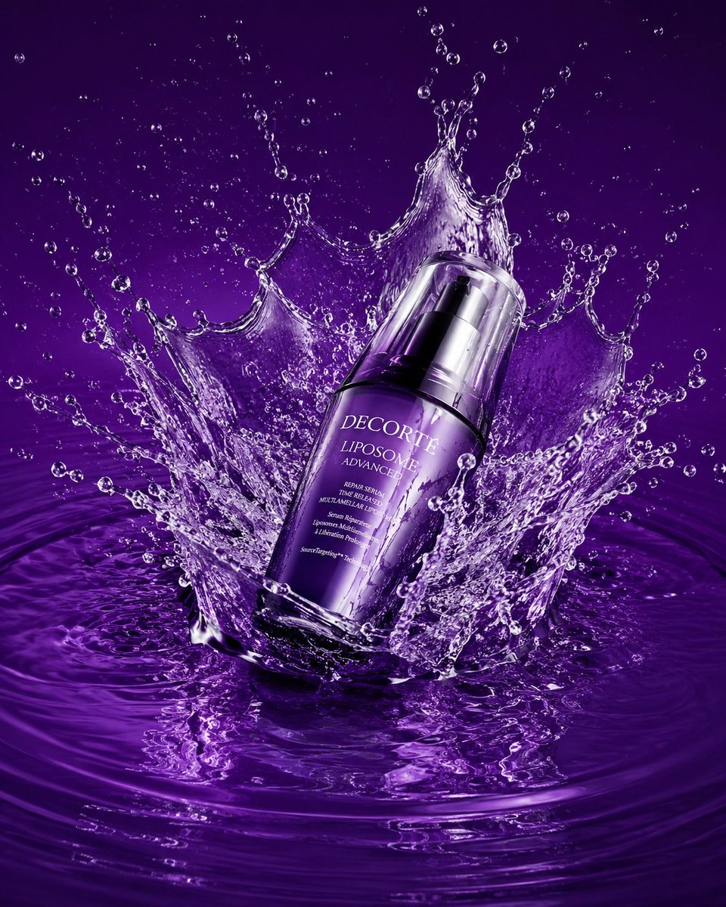

**Prompt:**

```text
Prompt - Hyper-realistic professional product photography, 4:5 aspect ratio. A skincare product bottle floating horizontally at the center of the frame, dramatically surrounded by an explosive water splash bursting outward in all directions -captured at high speed like a freeze-frame moment. The water is crystal clear with sharp defined droplets, ripples, and dynamic wave arcs catching the light. The surface below shows a deep violet-purple liquid with concentric ripple rings radiating outward from the impact point. The entire background is a rich deep royal purple - seamless, smooth, and saturated. The bottle is partially submerged in the splash, tilted slightly, label facing upward and clearly visible. Dramatic studio lighting with specular highlights on water droplets and bottle surface, deep purple reflections on the liquid surface. Luxury beauty brand product campaign, editorial cosmetic photography, ultra-realistic high-speed water photography aesthetic, 8K, shot on Canon EOS R3 with high-speed sync flash, no model, no text overlay, no watermark --ar 4:5
```

[Original post](https://x.com/i/status/2051845000082985389)

### GPT Image 2 Prompt Case 0057: #每天一个提示词 做了一个打工人+小人+手写励志语的prompt gpt-image2 提示词： 保持原图所有内容不变（人物、脸、身形、姿势、光线、办公室背景）

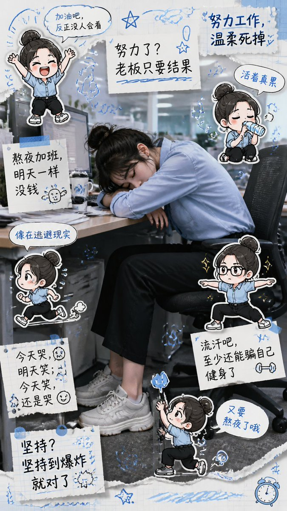

**Prompt:**

```text
#每天一个提示词 做了一个打工人+小人+手写励志语的prompt
gpt-image2 提示词：
保持原图所有内容不变（人物、脸、身形、姿势、光线、办公室背景）。
画面四周添加小巧Q版迷你人物，大头圆脸、表情生动，穿搭发型与原人物一致：
- 高举双手喊“加油吧，反正没人会看”
- 桌旁慢跑“像在逃避现实”
- 喝水叹气“活着真累”
- 戴办公眼镜做运动姿势
```

[Original post](https://x.com/i/status/2051648496227525074)

### GPT Image 2 Prompt Case 0058: 💠GPT-image2で世界観＆キャラクターを作るPrompt # 【短縮最適化版】世界観＋オリキャラメーカー ChatGPT5.5向け ## 目的 オリジナル

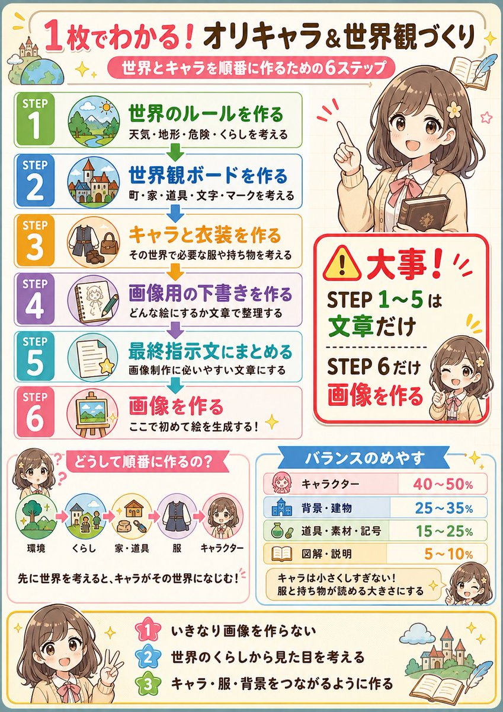

**Prompt:**

```text
💠GPT-image2で世界観＆キャラクターを作るPrompt
# 【短縮最適化版】世界観＋オリキャラメーカー ChatGPT5.5向け
## 目的
オリジナルアニメ向けの「世界観設定資料」と「キャラクター設定資料」を段階的に作る。
世界観だけが目立つ画像でも、キャラクターだけが浮く画像でもなく、背景・建築・道具・素材・文字・文化記号・衣装・人物が同じ世界から生まれているように見える設定資料風ビジュアルを目指す。
## 最重要ルール
- 1回の返答では1STEPだけ実行する。
- STEP 1〜5では画像を生成しない。文章だけを出力する。
```

[Original post](https://x.com/i/status/2050886718241513598)

### GPT Image 2 Prompt Case 0059: Prompt: A hyper-realistic cinematic close-up portrait of a rugged young man stan

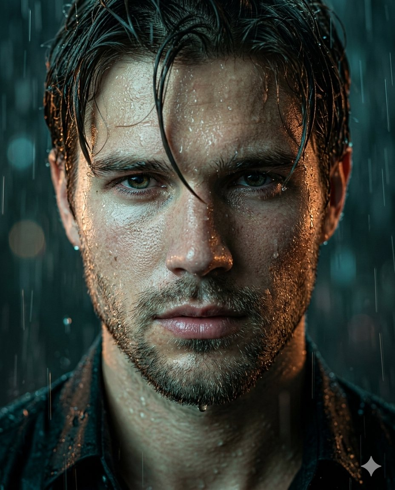

**Prompt:**

```text
Prompt:
A hyper-realistic cinematic close-up portrait of a rugged young man standing in heavy rain, water droplets glistening on his skin and beard.
His wet hair clings to his forehead, with intense, emotional eyes looking slightly downward.
Dramatic lighting with a mix of teal and warm orange tones reflecting on his face, creating a moody contrast. Raindrops frozen in motion, ultra-detailed skin texture, visible pores, and water reflections. Shallow depth of field with soft bokeh in the background. Dark, atmospheric environment, cinematic color grading, 8K resolution, sharp focus, volumetric lighting, HDR, photorealistic, masterpiece.
Ratio 4:5
```

[Original post](https://x.com/i/status/2051623526310810063)

### GPT Image 2 Prompt Case 0060: Prompt: A frosted Emerald-yellow tube labeled "Banana Glow" standing on a smooth

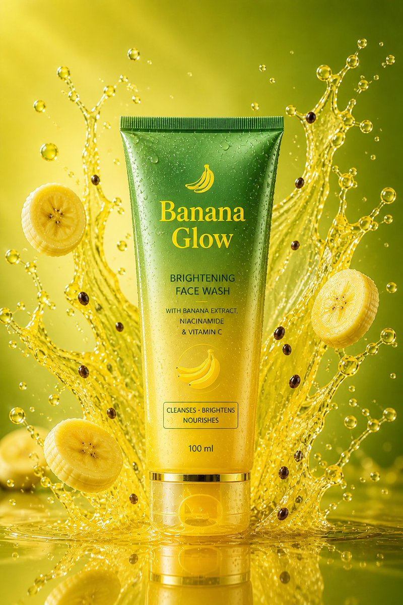

**Prompt:**

```text
Prompt: A frosted Emerald-yellow tube labeled "Banana Glow" standing on a smooth glossy surface, with vibrant Banana juice splashes and seeds exploding mid-air around the product. Minimal soft yellow- green gradient background, luminous and glossy lighting.
```

[Original post](https://x.com/i/status/2051498536974602331)

### GPT Image 2 Prompt Case 0061: ➡️ Prompt: Storyboard Image Prompt: Create a clean, colorful, realistic 15 shot

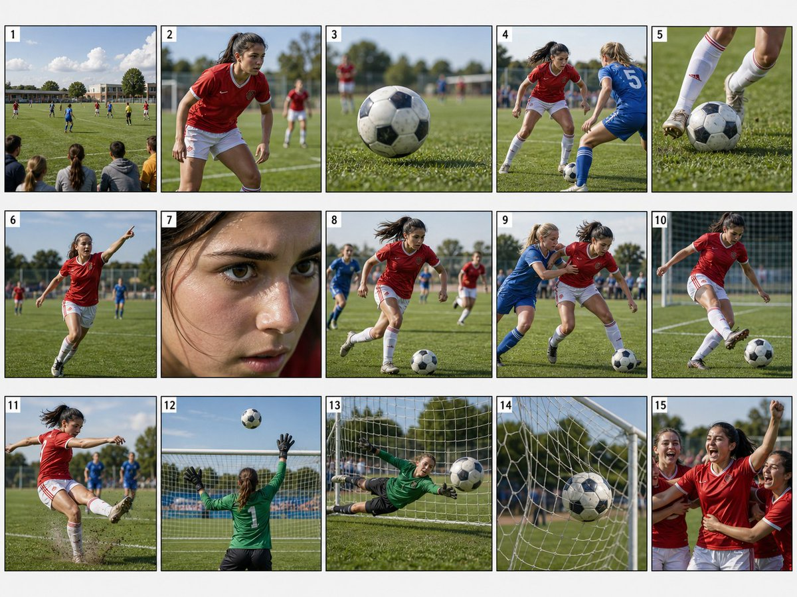

**Prompt:**

```text
➡️ Prompt: Storyboard Image Prompt:
Create a clean, colorful, realistic 15 shot storyboard in a 3x5 grid layout on a single page, showing a girls’ football match from start to finish. Each panel must be clearly separated with thin borders and include a small white number box in the top-left corner, numbered 1 to 15. The overall style should look like real sports photography, bright daylight, natural colors, outdoor football field, realistic grass texture, realistic facial expressions, dynamic action, and cinematic visual storytelling.
The main subject is a young female football player with dark hair tied in a ponytail, wearing a red jersey, white shorts, white knee socks, and football boots. She should remain visually consistent across all panels. The opposing team wears blue jerseys, and the goalkeeper wears a green jersey. The setting is an outdoor football field with goalposts, net, white field markings, trees, and a few spectators in the background.
Panel breakdown:
Wide establishing shot of the football field, players from both teams spread across the pitch, spectators in the foreground, bright blue sky with clouds.
Medium shot of the main female player in red getting ready, focused and determined.
Close-up of the football rolling on the grass.
Action shot of the main player facing a defender in blue.
```

[Original post](https://x.com/i/status/2051024310098358541)

### GPT Image 2 Prompt Case 0062: prompt👇 一张前卫的数字艺术作品。 1. 画面基础：达·芬奇的《蒙娜丽莎》经典画像。 2. 故障效果（Glitch）： - 蒙娜丽莎的脸部正在发生严重的“

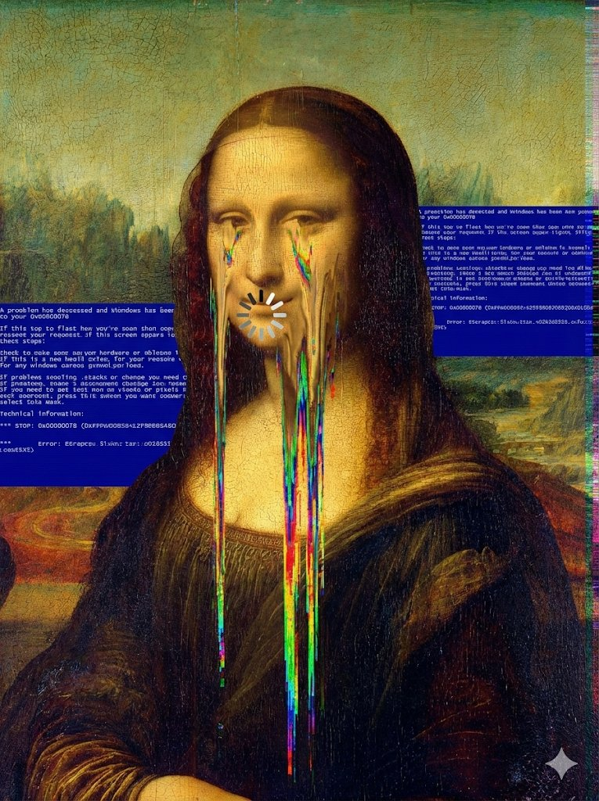

**Prompt:**

```text
prompt👇
一张前卫的数字艺术作品。
1. 画面基础：达·芬奇的《蒙娜丽莎》经典画像。
2. 故障效果（Glitch）：
- 蒙娜丽莎的脸部正在发生严重的“像素格拉变（Pixel Sorting）”，像液体一样向下流淌。
- 画面背景穿插着 Windows 经典的“蓝屏死机”错误代码（0x000000 error）。
- 她的微笑部分被一个加载进度的缓冲圆圈（Buffering icon）遮挡住了。
3. 风格对比：油画的古老龟裂纹理（Craquelure）与锐利的RGB数字噪点并存。
```

[Original post](https://x.com/i/status/2046815751776915607)
